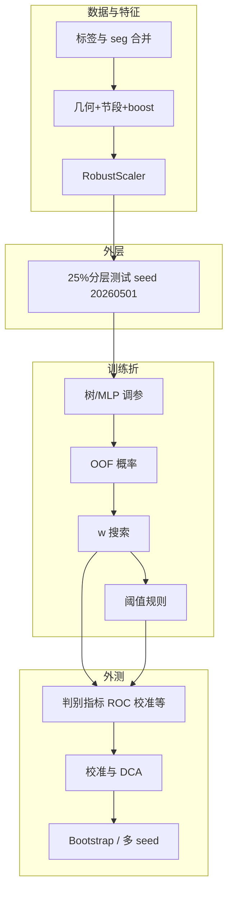
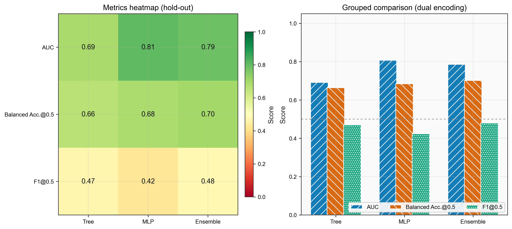
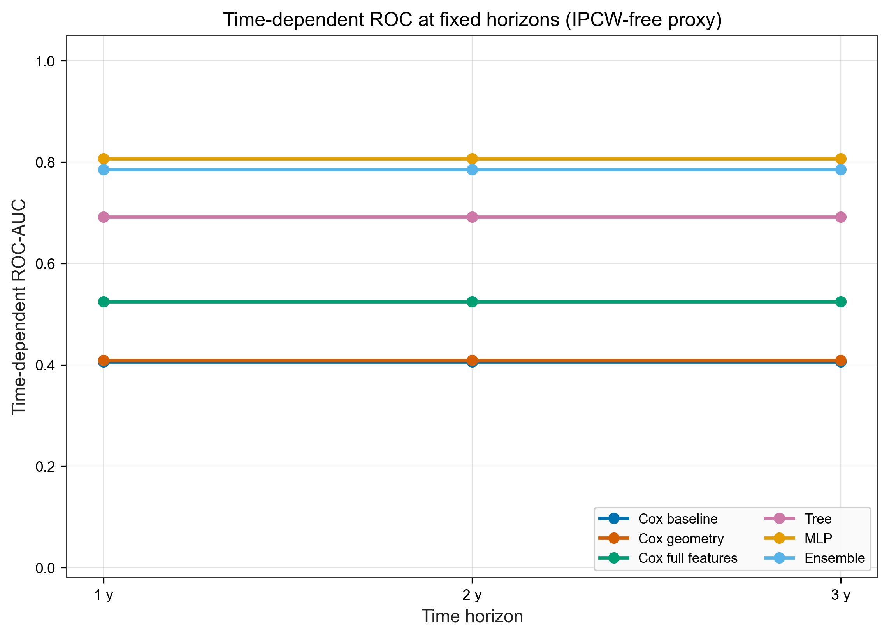
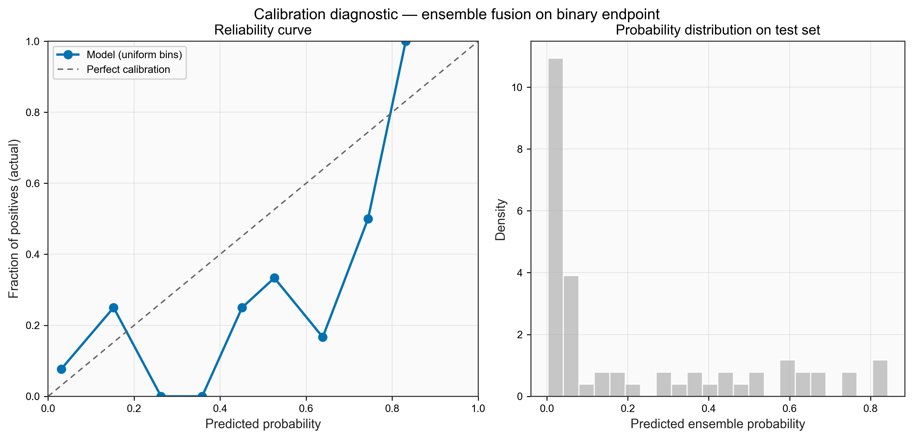
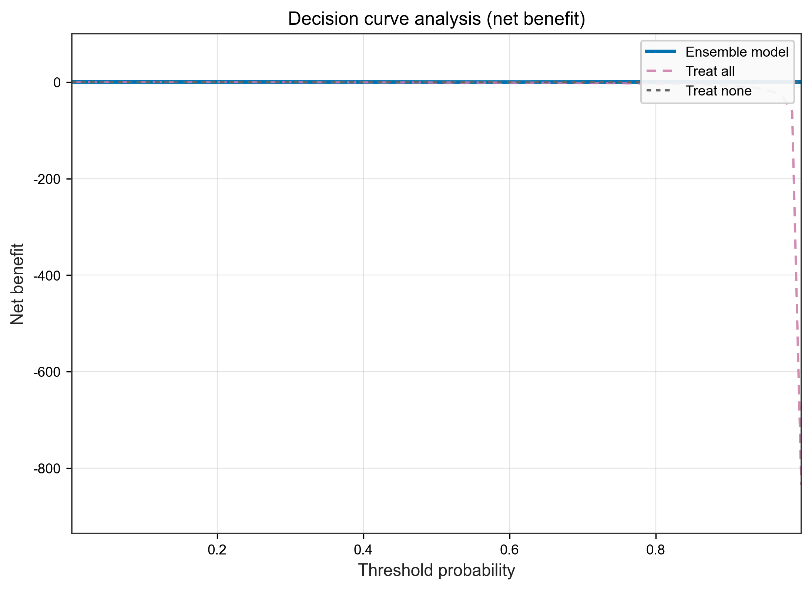
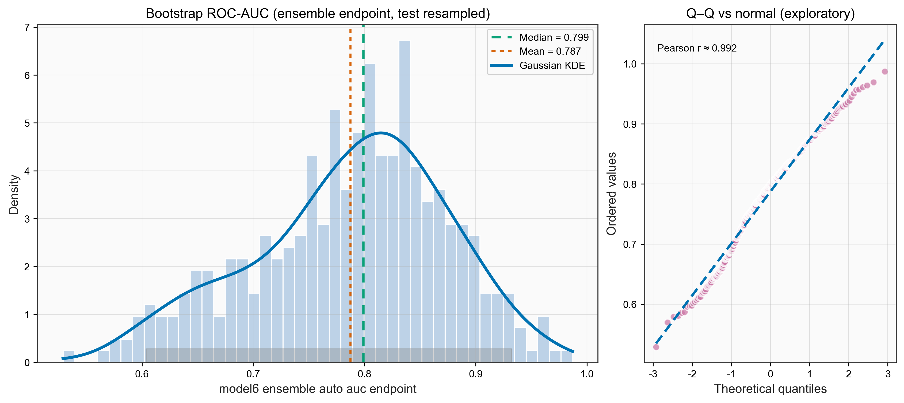
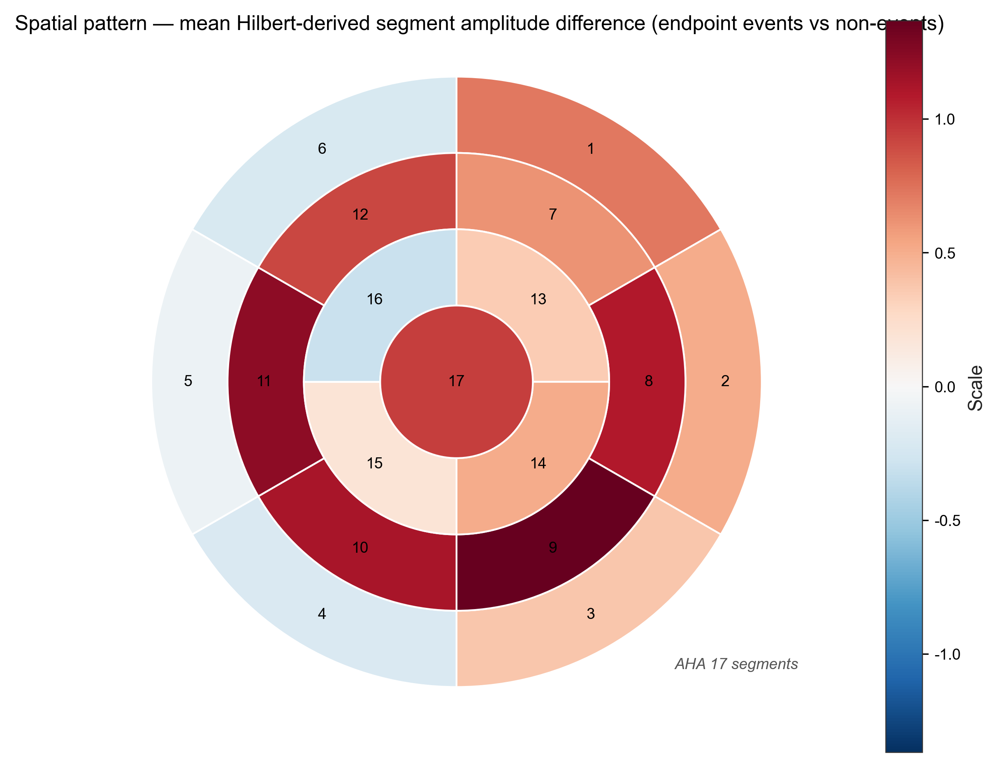
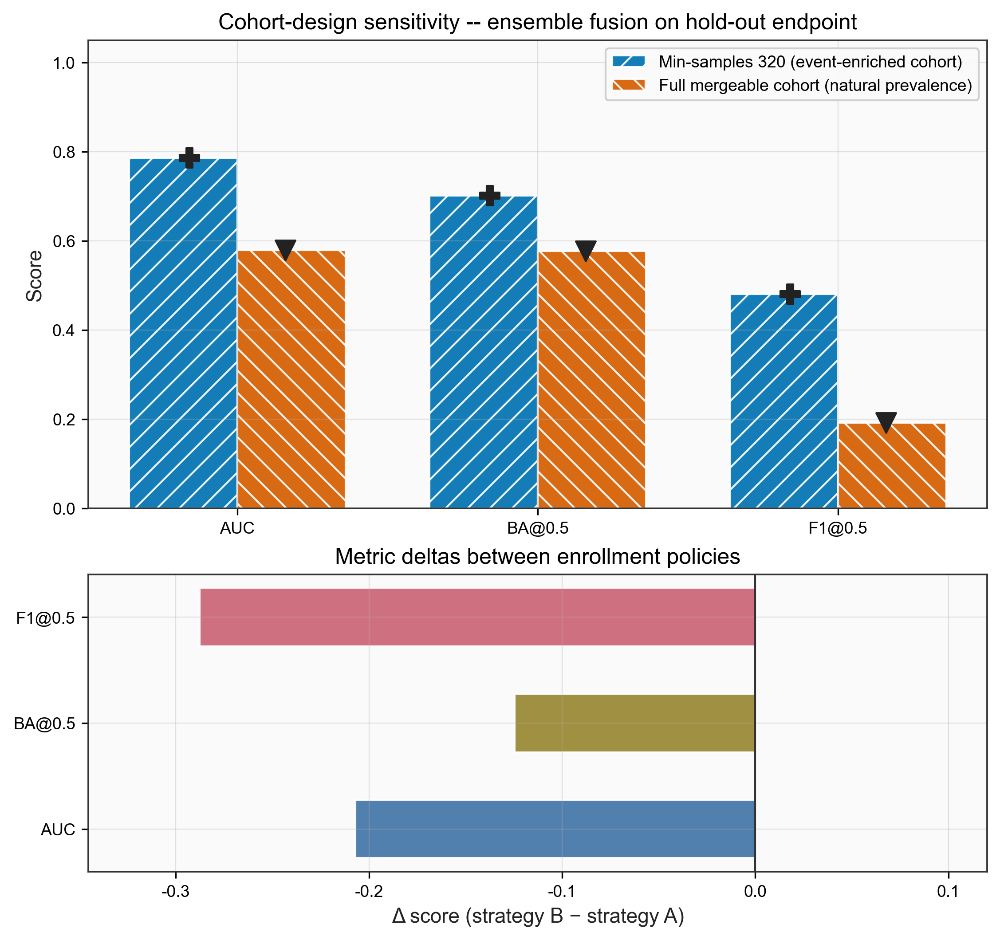

# 心脏磁共振几何与节段不同步特征的临床结局预测：基于实验探索逻辑的学术报告

> **材料索引**（路径均相对于本提交包根目录）
> - **本报告**：`report_academic_integrated.md`
> - 主流程脚本：`01_code/deep_experiment_full_gpu.py`
> - **择优冠军目录**：`outputs_clinical_endpoint_n320_bs400/`
> - 择优说明：`report_champion_selection.json`
> - 冠军归档：`report_champion_bundle_20260501_1338/`；队列勘测：`cohort_scout_summary.json`

**叙事说明**：下文按 **「提出问题 → 固定评估协议 → 实验推进 → 随文附图/表」** 组织。图表与 **表 1–7**、**图 1–12** 的默认数据根目录为 **`outputs_clinical_endpoint_n320_bs400/`**（另含 `figures_extra/`、`outer_test_predictions_bundle.csv`）；**§4.9** 等对 **full-cohort**（全可获得队列敏感性）的引用见该节说明。**表号**按全篇统一编号，**在正文中的出现顺序**不必与表 1、2、3 数字升序一致。**Bootstrap** **B=400**；多 seed 见 `protocol.json` 之 `eval_seeds`。**文内引用**以方括号序号 `[n]` 对应 **§7 参考文献**。

---

## 摘要

**目的**：在多中心心脏磁共振分割数据上，用几何与 **17 节段 Hilbert 相位不同步** 特征，探索 **可同时支撑排序（AUC/C-index）、固定外测复述与临床可读阈值** 的建模路径；判别任务对齐 Excel 读出列 **`endpoint`（0/1 终点事件指示）**，随访跨度由列 **`time`（天）** 表征（术语约定见 §2）。

**推进逻辑**：首先在 **scout** 厘清可抽取与可合并上限；再在 **恒定外层分层划分**（`test_size=0.25`、`stratify=endpoint`、`seed=20260501`）下，平行推进 **Cox/时间依赖 AUC** 与 **树–MLP–融合判别**；随实验批次增加 **校准、DCA、Bootstrap、多 seed 与两种入组策略**，并以 **加权综合评分**择优形成「冠军」输出。

**主要结论（冠军 `outputs_clinical_endpoint_n320_bs400`）**：融合模型外测 **AUC≈0.786**；阈 **0.5** 下 **BA≈0.701 / F1≈0.48**；依 OOF **主阈值**（≈0.259）外测 **Sens≈0.64 / Spec≈0.71 / NPV≈0.91**。**full-cohort** 敏感性显示 **`endpoint`=1（事件阳性）占比降低时** AUC 明显下探（≈0.58），提示外推须与 **入组与研究设计**共读。校准副业 **isotonic** 可改善 **Brier/ECE**。**局限**：测试集中 **`endpoint`=1** 仅 **11 例**，区间较宽；早期 sprint 的监督标签在 **`time`≤1095 天规则下另行构造**，与本篇 **树/MLP/融合直读 `endpoint`** 的任务定义不同——**比较两类数字前须先说明标签与截断规则**（§2、§4.11）。

---

## 1　引言：从临床决策需求到探索路线

临床研究不仅关心模型能否把人排对序，还要求 **可操作阈值**、依赖 **`endpoint`=1 先验占比**（患病率）条件下的 **PPV/NPV**、合理的 **校准** 与 **给定阈值下的净获益**——与临床预测模型的报告关注点一致[6][13]。影像学侧，本工作在可复现实验脚本中串联 **几何量 + 17 段节段特征 + 训练中自动生成的 boost 拼接协变量**，将「特征构造—划分—训练—外测」做成 **可重复的实验管道**，并在管道之上 **递增** 校准、DCA、阈值与不确定性分析[5][7][12]。

**与前期 sprint / 其他批次的关系**：如 `outputs_deep_full_gpu_sprint3/` 曾在 **固定 `time` 上限（脚本取 1095 天）与特定规则下** 另行定义 **二类训练标签**（与当前 Excel 直接读入的 **`endpoint`** **不是同一监督任务**）。本篇主线的树/MLP/融合 **以 Excel 所列 `endpoint∈{0,1}` 为监督**；**1095、365/730/1095** 等仍出现于 **入队筛选、生存分析、time-dependent ROC 的 horizon**，其角色在 §2 与各相关小节分述。将 **sprint 的 `auc_1095d` 等** 与本篇 **`endpoint` ROC-AUC** 对比时，建议 **先分列「标签与截断」** 再解读性能差异。

---

## 2　数据、特征与入组：scout 划定边界，策略创造「可学习任务」

### 2.1　字段与临床语义（避免将「随访间隔」与「终点变量」混淆）

本流水线（与 [`protocol_endpoint.json`](outputs_clinical_endpoint_n320_bs400/protocol_endpoint.json) 一致）对 Excel **`survival_clean(1).xlsx`** 的约定为：

| 列名（脚本沿用） | 类型与含义 |
|------------------|------------|
| **`time`** | **时间长度，单位为「天」**：表示可追溯的随访跨度，或与本研究时间轴一致的 **相邻关键时间节点之间的间隔（例如可用于刻画「影像检查至随访终点」跨度）**。Cox **duration** 与本报告中的 **`time`** 对齐；判断是否落在某一 **事前规定的日历截断**之内时，也使用 **`time`**。若课题组口语习惯把「两次就诊相隔天数」简称为另一类说法，请以 **表中 `time` 列** 为准承载 **连续天数**。 |
| **`endpoint`** | **二分类终点指示**，取 **0 或 1**（与本仓库流水线读入、`protocol_endpoint.json`「1=事件发生」记载一致）：**1** = 在给定 **`time`** 定义的随访跨度内 **观察到终点事件**；**0** = **未观察到**（删失在 Cox / 生存分析中以 **`endpoint` + `time`** 共同表达）。该列 **不是**「随访间隔天数」本身，**亦非**固定以「36 个月」重写后的变量；分析与入组中出现的 **≤1095 天** 仅作用于 **`time` 的比较或历史 sprint 的监督构造**。 |

脚本中 **`min-events-3y`（配以 1095 天）**、早期 sprint 的 **二类代理标签**以及 **365 / 730 / 1095** 在图上的 **horizon**（常对应约 12/24/36 个公历月折算天数），均为 **分析时可调的时间截断或历史任务定义**；**其作用对象主要是 `time` 或已构造的代理标签**，**不宜**在文字上误写为「**`endpoint` 列等价于三年」或「`endpoint` 由 36 个月定义」。

---

**标签数据源**：除上表所列外，不完整行剔除，读入后与 `patient_id`、`seg` 合并。

**影像与特征**：`seg/` 下每名受试者 **≥10 帧** 有效分割；流水线提取 **心肌环几何量**（如 `Ldiast`、`Rdiast`、`kappa`、`Eclose`、`DeltaTheta`）与 **`seg01_amp`–`seg17_amp`**（分段命名与临床实践中的心肌分段模型一致[1]）；在 **训练集**上按事件/非事件节段均值差自动生成 **segment boost**，与基特征拼接后 **RobustScaler**[11]（仅训练拟合）。

**可及上限（scout，[`cohort_scout_summary.json`](cohort_scout_summary.json)）**：seg **1223** 例；合并标签 **1477** 行；唯一患者 **1015**；**特征成功 1067**，失败约 **410**。**探索含义**：建模 `N` 的上限已由数据工程过滤，其后是在此边界内如何做 **任务定义与入组**。

**两类已执行入组策略**（均在同一脚本体系中实现）：
- **主分析（≈320 策略）**：事件优先与各 cohort **配额**；在 **`time`≤1095 天** 子条件内对 **`endpoint`=1** 病例数设 **下限**（参数历史名 `min-events-3y`，**此处 1095 天仅作软件中的日历常数**），使可建模子集中 **事件（`endpoint`=1）比例相对升高**，以利于判别学习及方法学展示。
- **`--full-cohort`**：**标签×seg 可合并且 `patient_id` 去重** 的全可获得队列，**`endpoint`=1** 所占比例通常更低，学习任务更难。

这两条路径的差异 **在下文 §4.9 专门用定量与图示说明**，避免混淆「模型失效」与「任务变难（阳性占比变化）」。

---

## 3　评估协议与方法骨架：所有后续实验的共同「赛道」

**外层划分**（恒定）：
```text
train_test_split(test_size=0.25, stratify=endpoint, random_state=20260501)
```
**泄漏控制**：融合权重、树/MLP 超参 **仅由内层 CV/OOF 决定**；**所有用于临床复述的阈值** 均在 **训练 OOF 融合概率** 上确定后再用于 **同一固定外测**。流程示意如下。



**Cox 轴**：三组协变量（基础 / 几何扩展 / 全特征），内层惩罚与网格选择与脚本一致；比例风险模型与一致性（C-index）评价为生存建模中的常规框架[2][3]，**给定 calendar horizon** 的 time-dependent 判别亦为删失与时间结构下常用的图示化刻画[4]（正文实现为其 **IPCW 无关的 horizon 二元代理**，解读时需注意与教科书定义差异）。**判别轴**：**XGBoost**[9]（或 RF **回退**）、**浅层 MLP**，折内打分 **`0.4·AUC + 0.3·BA + 0.3·F1`（阈值 0.5）**；训练 OOF 上搜索 **融合权重 `w`**；ROC–AUC 等排序指标的通用含义见 Hanley–McNeil 的经典讨论[14]。

**阈值规则（OOF 上定义）**：

| 规则 | 含义 |
|------|------|
| `max_balanced_accuracy` | 主规则：最大化 (Sens+Spec)/2 |
| `max_youden_j` | 最大化 Youden J |
| `conservative_high_specificity` | Sens≥0.75 约束下最大化 Spec |
| `aggressive_high_sensitivity` | Spec≥0.75 约束下最大化 Sens |

**校准与副业**：uniform 分层下的可靠性曲线[7]与 **DCA**[5]，并报告 **Brier 分数**[10] 等概率质量指标；可选用 **OOF isotonic**[8] 调整融合概率（`--oof-isotonic-calibration`）并导出 `_isotonic` 附图（不改变主文件名体系）。

本节不堆结果数；具体数字全部由 **§4** 在对应实验步骤给出。

---

## 4　实验推进：自洽批次、择优冠军与嵌图嵌表论证

本节是正文核心：**按实验推进顺序编排**；每张图 / 每张表仅在正文出现一次，并与当期论证绑定。

> **正文约定**：除 **§4.9–§4.10** **明确写明**的路径及 **§4.11** 史学脚注外，本章 **量化结果与图示文件**默认相对目录 **`outputs_clinical_endpoint_n320_bs400/`**。列名 **`endpoint`、`time`** 的含义以 §2 与课题数据字典为准；若院内口语与表格列名不一，撰稿时请以 **字典 + 脚本** 对齐后引用。

### 4.1　批次谱系：我们尝试了哪些跑道，择优如何落脚

已在仓库落盘的实验批次示例（同一脚本，参数组合不同）：

| ID | 输出目录（相对提交包根目录） | 入组 / 要点 | 树/MLP/融合标签 | 备注 |
|----|--------------------------------------|-------------|-----------------|------|
| E0 | `outputs_deep_full_gpu_sprint3` | 历史 sprint | 基于 **`time`≤1095 天** 构造的代理二类标签（与本篇 **`endpoint`** 字段不同） | 仅作史学定位 |
| E1 | `outputs_deep_full_gpu_clinical_endpoint` | 首批 endpoint | **`endpoint`** | 冒烟扩展 |
| E2 | `outputs_clinical_endpoint_n320_bs400` | `min_samples=320`, `bootstrap=400` | **`endpoint`** | **择优冠军（下文默认）** |
| E3 | `outputs_clinical_endpoint_full_bs400` | `--full-cohort`, `bootstrap=400` | **`endpoint`** | **`endpoint`=1** 稀疏 / 敏感性 |
| E4 | `outputs_clinical_endpoint_full_bs400_seeds5` | 较 E3 增 eval-seeds | **`endpoint`** | 稳健加厚 |
| E5 | `outputs_clinical_endpoint_champion_n320_iso` | 冠军入组 + isotonic | **`endpoint`** | 校准副业 |
| Pack | `report_champion_bundle_20260501_1338/` | — | — | 归档拷贝 |

**择优准则**（`report_champion_selection.json`）：外测 **`model6_ensemble_endpoint`** 上 **`0.4·AUC + 0.3·BA@0.5 + 0.3·F1@0.5`** 极大化；平局 **MCC@0.5** 更大优先，再 **Brier** 更小。**E2（本目录）** 构成正文主干；**§4.2–§4.8** 的图表与表里数字默认来自本次 E2 跑批；**§4.9** **另附** **full-cohort** 输出目录 **`outputs_clinical_endpoint_full_bs400/`** 的数字与图；**§4.10–§4.11** 为校准副业与其它监督口径的注意项。

**冠军外层划分简述**（`protocol_endpoint.json`）：训练 **199**（其中 **`endpoint`=1** 共 **34**，占 **17.1%**）；测试 **67**（其中 **`endpoint`=1** 共 **11**，占 **16.4%**）； cohort 计数 RJ_az **41** / me **146** / zhang **79**。

---

### 4.2　第一步判别：阈 0.5 处的 tree / MLP / 融合与「heatmap+柱」复核

在完成 **外层划分 — 特征缩放 — OOF 定 `w`** 后，我们首先在外测读出 **二类 endpoint 判别**（与临床常用的 **0.5 概率阈**对齐），并与 **判别排序（AUC）**、**校准误差（Brier/ECE）** 一并观察。

#### 表 1　endpoint 二分类（阈值=0.5）与概率质量（冠军外测，`metrics_endpoint_binary_test.csv`）

| 模型 | AUC | Bal.Acc@0.5 | F1@0.5 | MCC@0.5 | Brier | ECE |
|------|-----|-------------|--------|---------|-------|-----|
| Tree (`model4_tree_endpoint`) | 0.692 | 0.664 | 0.471 | 0.425 | 0.119 | 0.113 |
| MLP (`model5_mlp_endpoint`) | **0.807** | 0.684 | 0.424 | 0.291 | 0.173 | 0.174 |
| Ensemble (`model6_ensemble_endpoint`) | 0.786 | **0.701** | **0.480** | 0.367 | 0.132 | 0.149 |

**本步可读结论**：单次划分上 **MLP 的 endpoint AUC 最高**；**融合在 0.5 阈值下提高了 BA/F1**，并与预选 **加权综合分 ≈0.669** 一致。**探索延续问题**：仅以 0.5 与 scalars 仍不足以回答 **时间尺度上的排序一致性**——故进入 **§4.3**。为将「三模型并排」转成 **出版级自检图**，可由 CSV 绘制 **热力图–分组柱**（**图 7**）。

#### 图 7　三模型外测 endpoint 指标的「热力图 + 分组柱」双编码（`figures_extra/`）



---

### 4.3　第二步并行轴：Cox/C-index 与 time-dependent AUC「是否同人同赛」？

同一外测上报告 **原始 / 符号校正 C-index**。对 **给定 horizon** **h ∈ {365, 730, 1095}**（与 `time` 单位一致，为天；图示上可作约 12/24/36 个月的阅读辅助），脚本构造 **二进制结局** **`I(endpoint=1 且 time≤h)`**，与各模型打分算 **ROC-AUC**（表中 **AUC@365d / 730d / 1095d**）。此即 **在给定日历长度内是否发生记录的终点事件**的排序判别，**与直接使用列 `endpoint` 作为全体外测判别标签（§4.2、§4.4）是不同层级的问题**；**h 只进入该子任务的标签构造**，**不改写** **`endpoint`** 在研究表中的语义。

#### 表 3　C-index（raw/adj）与各 horizon 之 time-dependent AUC（`metrics_fixed_test.csv`）

| 模型 | C-index（raw） | C-index（adj） | AUC@365d | AUC@730d | AUC@1095d |
|------|----------------|----------------|----------|----------|-----------|
| model1_base_cox | 0.463 | 0.537 | 0.406 | 0.406 | 0.406 |
| model2_geom_cox | 0.556 | 0.556 | 0.409 | 0.409 | 0.409 |
| model3_full_cox | 0.593 | 0.593 | 0.524 | 0.524 | 0.524 |
| model4_tree_auto | 0.519 | 0.519 | 0.692 | 0.692 | 0.692 |
| model5_mlp_auto | 0.722 | 0.722 | 0.807 | 0.807 | 0.807 |
| model6_ensemble_auto | 0.630 | 0.630 | 0.786 | 0.786 | 0.786 |

#### 图 1　多模型 time-dependent AUC（horizon：**365 / 730 / 1095** 天；与 §4.2、§4.4 单列 `endpoint` 判别不同，见上文）



**小结**：在上述 **依赖 `time` 与 horizon 的子任务** 上，MLP / 融合的 time-dependent AUC 仍较高，Cox 全模型相对树/判别器偏弱——与 **直接使用 `endpoint` 的全样本二类判别**并行，可作为 **预后时间结构**的补充呈现。

---

### 4.4　第三步：二元 endpoint 的「标准 ROC（FPR–TPR）」钉住排序叙述

在完成 **时间点扫描**之后，必须把读者带回 **`endpoint` 本体**上最常见的 **灵敏度–特异度平面图**，并与 **表 1** AUC **同一标签口径**。**图 2** 使用外测 bundle 给出的 **tree / MLP / 融合概率** 与 **Cox 全模型的风险得分**（风险亦为合法排序刻度）画 **ROC**。对角线为 **随机参照**。

#### 图 2　外测 endpoint 多曲线 ROC（`figures/roc_endpoint_multimodel_test.png`）


---

### 4.5　第四步：校准与决策曲线——「概率是否可信」「是否值得一试」？

若仅用 AUC，会掩盖 **校准不良**导致的 **阈值解读失败**。**图 3** 为融合概率的 **可靠性曲线与概率分布**并排；**图 4** 为 **DCA**，与 intervention-for-all / none 比对 **净获益**。

#### 图 3　融合校准诊断（校准 + 预测概率密度，`figures/`）



#### 图 4　决策曲线 DCA（`figures/`）



**探索延伸（可选副业）**：在 **`outputs_clinical_endpoint_champion_n320_iso`** 若已生成带 `_isotonic` 后缀的同构图与 CSV，可作 **附录图 S1/S2**——见 **§4.10**。**主文不改变图 3/4 的默认文件名。**

---

### 4.6　第五步：OOF 上选阈值，外测「复述临床操作点」——不是调参再用测试集

阈值 **完全来自训练折 OOF 融合概率** 的规则扫描；每条规则对应一个 **阈值**，在外测复述 **Sens / Spec / PPV / NPV / LR / BA / F1** 见 **表 2**，可视化见 **图 8**。**图 8** 为三指标柱状与 **Sens–Spec** 散点（标记大小 / 颜色对应 BA）。

#### 表 2　融合模型：按 OOF 规则选阈在外测上的表现（`clinical_thresholds_test_performance.csv`；单次 AUC 与此前一致）

| 规则（OOF） | Sens | Spec | PPV | NPV | LR+ | LR− | BA | F1 |
|-------------|------|------|-----|-----|-----|-----|-------|-------|
| `max_balanced_accuracy` (= `max_youden_j`，阈≈**0.259**) | **0.636** | **0.714** | **0.304** | **0.909** | **2.23** | **0.51** | **0.675** | **0.412** |
| `conservative_high_specificity`（阈≈**0.068**） | 0.727 | 0.625 | 0.276 | 0.921 | 1.94 | 0.44 | 0.676 | 0.400 |
| `aggressive_high_sensitivity`（阈≈**0.130**） | **0.727** | **0.661** | 0.296 | 0.925 | 2.14 | **0.41** | **0.694** | **0.421** |

**阅读提示**：在低 PPV 与 **相对较高 NPV** 并存时，叙事需与外测 **`endpoint`=1 占比（约 16%）** 绑定；该比例不同于自然人群发病率，亦非对列 **`endpoint`**「按年」重新定义。

#### 图 8　阈值规则的柱–散点复合图（`figures_extra/`）


---

### 4.7　第六步：Bootstrap 与多 seed——小测试集阳的「区间语言」与「抖动语言」交替

外层测试集中 **`endpoint`=1** **仅 11 例**：点估计宜与 **Bootstrap 等非参数区间**共读。

- **Bootstrap（B=400）**：重复扰动 **外测索引** 堆积 ROC-AUC（及主阈下 Sens/Spec/BA/F1），得 **百分位区间**（**非**严格贝叶斯后验）。
- **多 seed（默认 3）**：**冻结划分与融合权重**，仅重置树与 MLP 初始化，观察 **判别与阈上性能的稳定性**。

#### 表 4　Bootstrap 摘要节选（`metrics_ci_summary.csv`）

| 指标 | 均值 | 2.5% | 97.5% |
|------|------|------|-------|
| model6_ensemble_auto_auc_endpoint | 0.787 | 0.604 | 0.932 |
| model5_mlp_auto_auc_endpoint | 0.810 | 0.661 | 0.932 |
| model4_tree_auto_auc_endpoint | 0.699 | 0.485 | 0.901 |
| model6_ensemble_balanced_accuracy_thr_oob | 0.681 | 0.520 | 0.844 |
| model6_ensemble_f1_thr_oob | 0.410 | 0.207 | 0.611 |
| model6_ensemble_sensitivity_thr_oob | 0.648 | 0.333 | 0.925 |
| model6_ensemble_specificity_thr_oob | 0.715 | 0.597 | 0.825 |

#### 图 9　Bootstrap 区间「森林摘要」可视化（融合，`figures_extra/`）


#### 图 10　融合 endpoint AUC 的 Bootstrap：**直方图 + KDE + 正态 Q–Q**（`figures_extra/`）



#### 表 5　多 seed 概要（固定 OOF 主阈，`seed_repeat_summary.csv`）

| 指标 | 均值 | 2.5% | 97.5% |
|------|------|------|-------|
| model6_ensemble_auc_endpoint | 0.797 | 0.794 | 0.799 |
| model6_ba_thr_oob | 0.678 | 0.667 | 0.692 |
| model6_f1_thr_oob | 0.416 | 0.401 | 0.436 |
| model6_spec_thr_oob | 0.720 | 0.697 | 0.748 |

**前进小结**：Bootstrap 提醒我们 **单次 AUC 的区间仍可很宽**，而 multi-seed **在固定权重下的 AUC 抖动相对小**——两类不确定性回答不同问题。

---

### 4.8　第七步（解释性）：节段空间图景与「Cox 稳定进入 top5」的一致性

在进入 **`endpoint`=1 稀疏入组敏感性**的讨论之前，先在 **建模全队列空间**检视 **事件减非事件的节段振幅平均差**，并在 **训练 Bootstrap 重复拟合 Cox-full**时统计 **|coef|进入 top5节段** 的频率。**图 5/6** 为 AHA17 **映射**，**表 6** 与 **图 11（条形轨迹线）** 给出 **可读排序**。这与 **判别器**是分视角证据：解释性≠独立泛化验证。

#### 图 5　事件减非事件的节段均值差（matplotlib `RdBu_r` 色谱，`figures/`）



#### 图 6　Cox-full Bootstrap 稳定性映射（`|coef|` top-5 频率，`figures/`）


#### 表 6　节段进入 Cox-full（全协变量 Cox）模型 top5 的频率（节选，`segment_stability.csv`；≤200 次 bootstrap）

| 节段 | 进入 top5 次数 | 频率 |
|------|----------------|------|
| seg14_amp | 118 | 59% |
| seg06_amp | 114 | 57% |
| seg16_amp | 93 | 46.5% |
| seg10_amp | 76 | 38% |
| seg11_amp | 69 | 34.5% |

#### 图 11　上位节段频率「条 + 轨迹线」组合（`figures_extra/`）


---

### 4.9　第八步（外线探索）：入组设计改变任务难度——主分析 vs full-cohort

**与早期同标签跑法对比**（`outputs_deep_full_gpu_clinical_endpoint` vs 冠军 E2）：

| | AUC | BA@0.5 | F1@0.5 | 择优综合 |
|---|-----|--------|--------|----------|
| 早期 clinical_endpoint 融合 | 0.789 | 0.656 | 0.417 | **≈0.637** |
| **冠军 n320_bs400 融合** | 0.786 | **0.701** | **0.480** | **≈0.669** |

**full-cohort 敏感性（`outputs_clinical_endpoint_full_bs400`）**：训练 **578**（其中 **`endpoint`=1** ≈ **7.4%**），测试 **193**（≈ **7.8%**）。

| 模型（融合） | AUC | BA@0.5 | F1@0.5 | 择优综合 |
|---------------|-----|--------|--------|----------|
| `model6_ensemble_endpoint`（全队列） | **0.579** | 0.577 | 0.192 | **≈0.462** |

**图 12** 在主分析入组与 **full-cohort** 之间并排 **`endpoint`** 判别指标并作差分。**写法建议**：在未说明 **抽样 / 事件占比 / 配额**的前提下，不宜将两套入组对应的数字归结为单一的「优劣」论断。

#### 图 12　入组策略敏感性：并排柱 + 指标差分（`figures_extra/`）



---

### 4.10　第九步（可选支线）：同一入组下的 isotonic 与 NRI / IDI 探索

若以 **校准与决策曲线可读性**为重，副业 **isotonic** 可与 **§4.5（图 3–4）** 对照刊出；若以 **与原融合概率标尺一致**为原则，仍以 **§4.5** 主图为准。

#### 表 7　NRI / IDI（单次外测，`nri_idi_fixed_test.csv`，参照 model1_base_cox）

| 模型 | NRI vs base | IDI vs base |
|------|-------------|-------------|
| model2_geom_cox | −0.273 | −0.458 |
| model3_full_cox | +0.019 | **−87.33** |
| model4_tree_auto | 0 | +0.203 |
| model5_mlp_auto | 0 | +0.361 |
| model6_ensemble_auto | 0 | +0.290 |

**方法学警钟**：标尺混用可使 **IDI 极端**（见 NRI / IDI 相关讨论[15][16]）；表中 **full_cox IDI** 不宜作主定量结论。

---

### 4.11　语义边界：`outputs_deep_full_gpu_sprint3` **auc_1095d** 仅能作史学脚注

`sprint3` 等指标 **auc_1095d**（如文献中常汇报的 **`metrics_fixed_test.csv`** **AUC@1095d**）依附于 **前述 horizon 判别构造**；本篇 **表 1 / 图 2** 的 **`endpoint`** AUC **则基于列 `endpoint` 本身**。**并排引用时建议先分列任务**，再讨论模型差异。

---

## 5　综合讨论（收束多条探索支线）

**(1)** 本篇按 **scout → 协议固定 → 批次递增 → 择优冠军**书写，意在把 **判别、存活时间视角、校准、阈值复述、不确定性、解释性与入组敏感性**连成 **可追溯链条**，而非单点「报一个 AUC」。

**(2)** **判别器 vs Cox**：在 **依 `time` 截断的 time-dependent ROC**（图 1）上浅 **MLP / 集成** 排序常更强；在全队列 **`endpoint`=1** 仅占约 **8%** 的 **full-cohort** 入组下 **fusion AUC（≈0.58）** 回落，提示 **Rare-event（罕见阳性）与入组敏感性**——须与 **`endpoint` 占比** 共读，**不宜**仅从算法层面判优劣。

**(3)** **MLP vs 融合**：**MLP 排序常更强**，**融合**在 **加权综合准则**与 **校准/阈值点**上折中；部署选择应依赖 **外部数据与代价矩阵**而非单次划分玄学。

**(4)** **小样本与外测**：测试集 **`endpoint`=1** 仅 **11 例** ⇒ **Bootstrap 区间仍宽（表 4、图 9–10）**；多 seed 下 **endpoint AUC** 抖动相对小，二者互补。

**(5)** **NRI/IDI（表 7）** 指标体系与解释框架见参考文献[15][16]；本表仅供探索性阅读，不因单一数字作强结论。

**(6)** **局限**：多来源异质；**`endpoint`、`time`** 须在数据字典中与临床称谓一致（本报告已与当前脚本：二分终点 vs 随访天数）；sprint 与当前 **`endpoint`** 监督语义不同；Mermaid 在 Word 中或需导出为静态图。

---

## 6　结论

在 **固定外层划分与预选加权准则**下，**tree-MLP（树与浅层神经网络）融合**在主分析 **`min_samples≈320` 队列**上达到外测 **`endpoint`** 判别 **AUC≈0.79 量级**，阈 **0.5** 时 **BA/F1** 优于同标签早期冒烟融合；依托 **OOF 主阈值**可在外测复述 **Sens/Spec/NPV** 等。**full-cohort** 表明 **`endpoint`=1** 稀疏时判别排序显著走弱，宜与主分析 **并列陈述**。推荐使用 **`report_champion_bundle_20260501_1338`** 作为一级复现材料； **`outer_test_predictions_bundle.csv`** 中含外测 **`endpoint`、`time`** 与模型输出，便于复核。

---

## 7　参考文献

**[1]** CERQUEIRA M D, WEISSMAN N J, DILSZIAN V, et al. Standardized myocardial segmentation and nomenclature for tomographic imaging of the heart: a statement for healthcare professionals from the Cardiac Imaging Committee of the Council on Clinical Cardiology of the American Heart Association[J]. *Circulation*, 2002, 105(4): 539-542.

**[2]** COX D R. Regression models and life-tables[J]. *Journal of the Royal Statistical Society: Series B (Methodological)*, 1972, 34(2): 187-220.

**[3]** HARRELL F E JR, LEE K L, MARK D B. Multivariable prognostic models: issues in developing models, evaluating assumptions and adequacy, and measuring and reducing errors[J]. *Statistics in Medicine*, 1996, 15(4): 361-387.

**[4]** HEAGERTY P J, LUMLEY T, PEPE M S. Time-dependent ROC curves for censored survival data and a diagnostic marker[J]. *Biometrics*, 2000, 56(2): 337-347.

**[5]** VICKERS A J, ELKIN E B. Decision curve analysis: a novel method for evaluating prediction models[J]. *Medical Decision Making*, 2006, 26(6): 565-574.

**[6]** STEYERBERG E W, VERGOUWE Y. Towards better clinical prediction models: seven steps for development and an ABCD for validation[J]. *European Heart Journal*, 2014, 35(29): 1925-1931.

**[7]** HOSMER D W Jr, LEMESHOW S, STURDIVANT R X. *Applied Logistic Regression*[M]. 3rd ed. Hoboken: Wiley, 2013.

**[8]** ZADROZNY B, ELKAN C. Transforming classifier scores into accurate multiclass probability estimates[C]//Proceedings of the eighth ACM SIGKDD international conference on Knowledge discovery and data mining — KDD '02. New York: ACM, 2002: 694-699.

**[9]** CHEN T, GUESTRIN C. XGBoost: a scalable tree boosting system[C]//Proceedings of the 22nd ACM SIGKDD International Conference on Knowledge Discovery and Data Mining (KDD '16). ACM, 2016: 785-794.

**[10]** BRIER G W. Verification of forecasts expressed in terms of probability[J]. *Monthly Weather Review*, 1950, 78(1): 1-3.

**[11]** PEDREGOSA F, VAROQUAUX G, GRAMFORT A, et al. Scikit-learn: machine learning in Python[J]. *Journal of Machine Learning Research*, 2011, 12: 2825-2830.

**[12]** EFRON B, TIBSHIRANI R. *An introduction to the bootstrap*[M]. New York: Chapman & Hall, 1993.

**[13]** COLLINS G S, REITSMA J B, ALTMAN D G, MOONS K G M. Transparent Reporting of a multivariable prediction model for Individual Prognosis or Diagnosis (TRIPOD): the TRIPOD statement[J]. *Annals of Internal Medicine*, 2015, 162(1): 55-63.

**[14]** HANLEY J A, MCNEIL B J. The meaning and use of the area under a receiver operating characteristic (ROC) curve[J]. *Radiology*, 1982, 143(1): 29-36.

**[15]** PENCINA M J, D'AGOSTINO R B Sr, D'AGOSTINO R B Jr, et al. Evaluating the added predictive ability of a new marker: from area under the ROC curve to reclassification and beyond[J]. *Statistics in Medicine*, 2008, 27(2): 157-172.

**[16]** PENCINA M J, D'AGOSTINO R B Sr, STEYERBERG E W. Extensions of net reclassification improvement calculations to measures useful for categorical risk assessment[J]. *Clinical Epidemiology*, 2011, 3: 207-217.

注：Bootstrap 解释为 **外层测试集的重复抽样**，方法学上与文献[12]一致。

---

## 附录 A　图表文件名与正文图号对照（冠军目录）

| 文件（相对 `outputs_clinical_endpoint_n320_bs400/`） | 图号 | 正文绑定环节 |
|------------------------------------------------------|------|----------------|
| `figures/time_dependent_auc_curve.png` | 图 1 | §4.3 |
| `figures/roc_endpoint_multimodel_test.png` | 图 2 | §4.4 |
| `figures/calibration_curve_endpoint_ensemble.png` | 图 3 | §4.5 |
| `figures/decision_curve_endpoint_ensemble.png` | 图 4 | §4.5 |
| `figures/bullseye_standard_diff.png` | 图 5 | §4.8 |
| `figures/bullseye_top5_stability.png` | 图 6 | §4.8 |
| `figures_extra/fig_bar_models_endpoint_metrics.png` | 图 7 | §4.2 |
| `figures_extra/fig_bar_threshold_rules.png` | 图 8 | §4.6 |
| `figures_extra/fig_forest_bootstrap_ci_model6.png` | 图 9 | §4.7 |
| `figures_extra/fig_hist_bootstrap_ensemble_auc_endpoint.png` | 图 10 | §4.7 |
| `figures_extra/fig_bar_segment_stability_top.png` | 图 11 | §4.8 |
| `figures_extra/fig_compare_two_cohorts_ensemble.png` | 图 12 | §4.9 |
| `outer_test_predictions_bundle.csv` | — | ROC / 审稿复算 |

**表 1–7** 数据源：`metrics_endpoint_binary_test.csv`、`clinical_thresholds_*`、`metrics_fixed_test.csv`、`metrics_ci_summary.csv`、`seed_repeat_summary.csv`、`segment_stability.csv`、`nri_idi_fixed_test.csv`。其余：`bootstrap_metrics.csv`、`protocol.json`、`protocol_endpoint.json`。

---

## 附录 B　可复现实验命令范式

```powershell
# 在提交包根目录下打开终端后执行（路径均为相对 .\）
python ".\01_code\deep_experiment_full_gpu.py" --min-samples 320 --bootstrap 400 --compute auto ^
  --output-dir ".\outputs_clinical_endpoint_n320_bs400"

python ".\01_code\deep_experiment_full_gpu.py" --full-cohort --bootstrap 400 --compute auto ^
  --output-dir ".\outputs_clinical_endpoint_full_bs400"

python ".\01_code\pick_report_champion.py"

python ".\01_code\make_report_extra_figures.py" --output-dir ".\outputs_clinical_endpoint_n320_bs400" ^
  --compare-endpoint-csv ".\outputs_clinical_endpoint_full_bs400\metrics_endpoint_binary_test.csv"
# `make_report_extra_figures.py` 会重写 `figures/`（ROC、校准、DCA、time-dep AUC、bullseye）与 `figures_extra/`；带 `--compare-endpoint-csv` 时另写图 12。
```

导出 Word（与本包同步后的 MD）：

```powershell
python ".\01_code\export_md_to_docx.py" ".\report_academic_integrated.md" --base-dir "." -o ".\report_academic_integrated.docx"
```

---

*数值与图片均依据当前仓库已跑批次；更改 seed、bootstrap、入组或数据路径后，请以最新 `outputs_*` 目录复核。*
