# 基于心脏磁共振的肥厚型心肌病风险分层研究：多阶段建模与合作者方法整合

## 目录

1. [第一章 绪论](#第一章-绪论)
2. [第二章 材料与方法](#第二章-材料与方法)
3. [第三章 阶段一（中期）研究结果](#第三章-阶段一中期研究结果)
4. [第四章 阶段二研究结果（一）](#第四章-阶段二研究结果一形状流形与-2dt-运动学)
5. [第五章 阶段二·路径二](#第五章-阶段二路径二几何节段特征与临床终点预测主分析)
6. [第六章 阶段对照、任务边界与结果可读性说明](#第六章-阶段对照任务边界与结果可读性说明)
7. [第七章 讨论](#第七章-讨论收束多条探索支线)
8. [第八章 结论与展望](#第八章-结论与展望)
9. [参考文献](#参考文献)
10. [附录](#附录-a临床主分析图表文件与正文图号对照冠军目录)

---

## 摘要

**目的**：多中心短轴 CMR 的 HCM 风险分层；归纳早期工程化探索与后期并行的流形—预后双轨，并界定各轨任务边界。

**方法**：统一短轴 U-Net（§2.2）。早期：张量管线、HDF5、3D CNN/区域与传统模型。后期并行：（1）Kendall 形状流形与 2D+t；（2）几何—**AHA 17 节段**—Hilbert 相位特征，固定外层划分下 Cox/树/MLP/融合及校准、决策曲线、Bootstrap、入组敏感性分析。

**结果**：域移、Rare-event 与运动学表型分化在早期与流形分析中显现；冠军批次融合模型外测 **AUC≈0.786**（0.5 阈 **BA≈0.701，F1≈0.48**）；OOF 主阈下 **Sens≈0.64，Spec≈0.71，NPV≈0.91**。全队列敏感性 **AUC≈0.58**。跨轨比较须预先申明任务定义。

**结论**：可学习性诊断、流形运动学表述与终点对齐的预后模型相互补充；主文预后以冠军批次为准，其余分析在各自监督下独立报告。

**关键词**：肥厚型心肌病；心脏磁共振；多中心数据；深度学习；形状流形；临床终点；预测模型；TRIPOD

---

## Abstract

**Objective.** To stratify risk in hypertrophic cardiomyopathy using multi-center short-axis cardiac MRI, integrating early pipeline work with parallel late-stage manifold and clinical-endpoint modeling.

**Methods.** Shared U-Net-based segmentation; tensor and voxel/regional deep and classical baselines; parallel arms of Kendall shape space with 2D+t kinematics versus geometric and 17-segment phase features aligned to Excel `endpoint`/`time`, with fixed stratified data splits, Cox and tree/MLP/ensemble classifiers, calibration, decision-curve analysis, bootstrap resampling, and cohort-sensitivity analyses.

**Results.** Domain shift, class imbalance, and interpretable motion patterns emerged in early and manifold analyses. In the selected champion pipeline, the ensemble achieved external test AUC **≈0.786** (balanced accuracy **≈0.701**, F1 **≈0.48** at 0.5 probability threshold); at an out-of-fold–derived operating point, sensitivity **≈0.64**, specificity **≈0.71**, and NPV **≈0.91**. Full-cohort sensitivity yielded AUC **≈0.58**. Cross-arm metrics are not interchangeable without explicit task definitions.

**Conclusion.** Engineering feasibility, manifold-based kinematics, and endpoint-concordant prognostic models provide complementary evidence; headline prognostic numbers refer to the champion pipeline, with other chapters standing on their own supervision definitions.

**Keywords:** Hypertrophic cardiomyopathy; Cardiac magnetic resonance; Multi-center data; Deep learning; Shape manifold; Clinical endpoint; Prediction model; TRIPOD

---

## 第一章 绪论

### 1.1　研究背景与意义

肥厚型心肌病（HCM）常见且表型异质大，不良事件风险差异显著，风险分层直接影响干预决策。心脏磁共振（CMR）可无创定量刻画心肌形态与功能，广泛用于多中心队列。多中心数据在帧数、层厚、场强与体素间距上存在系统差异，影像—掩膜—随访构成高维异质链路；「能否学习、如何表征、能否对齐终点」须在可追溯流程下分阶段、多路径回答。在此对课题组前、中、后期工作进行系统整理。

### 1.2　研究目标与整体技术路线

（1）**阶段一**：数据规范化与早期深度/传统学习，定位可学习性与 Rare-event 瓶颈；（2）**阶段二**（并行）：**路径一**—Kendall 形状流形与 2D+t 运动学，侧重机理可读表型；**路径二**—几何—节段特征对齐 Excel **`endpoint`/`time`**，按 TRIPOD 维度报告；（3）统一界定任务边界，避免跨路径误读指标。短轴 U-Net（第二章 **§2.2**）与随访字段为共用的几何与标签入口。

### 1.3　论文结构说明

- **第二章**：材料与方法（导读、scout/终点、分割、特征、评估协议）。
- **第三章**：阶段一（张量规范化、质控、3D CNN/区域与传统基线）。
- **第四章**：阶段二路径一（合作者：流形与 2D+t）。
- **第五章**：阶段二路径二（临床终点主分析与敏感性）。
- **第六章**：阶段对照与并读禁忌。
- **第七章**：讨论。**第八章**：结论与展望。**参考文献**；**附录**（图表索引、复现、图号）。

### 1.4　临床预测模型报告规范与历史批次语义

下述约定与 TRIPOD 等报告规范一致，构成**路径二**的评价框架。


临床预测除排序外，还须 **阈值**、给定患病率下的 **PPV/NPV**、**校准**与 **净获益**[6][13]。本工作以脚本串联 **几何量 + 17 节段特征 + 训练期 segment boost**，形成可复现的「构造—划分—训练—外测」流水线，并递增校准、DCA、阈值与不确定性分析[5][7][12]。

**sprint 与主线的标签**：`outputs_deep_full_gpu_sprint3/` 在 **`time`≤1095 d** 等规则下另行构造二类标签，**≠** Excel **`endpoint`**。树/MLP/融合 **以 Excel `endpoint∈{0,1}` 为监督**。**1095、365/730/1095** 用于入组筛选、生存分析及 time-dependent ROC 的 **horizon**（§2 及各节）。对比 **sprint 的 `auc_1095d`** 与 **`endpoint` AUC** 时，**先分清标签与截断**。


---

## 第二章 材料与方法

### 2.0　方法体系与各章对应关系（导读）

与第三～五章对应，方法分层如下：

| 层次 | 阶段 / 路径 | 与本章及后文 |
|------|----------------|----------------------|
| **共享工程** | 全体 | §2.2 分割；§2.1：`scout`、`endpoint`/`time`（路径二标签） |
| **阶段一** | 前期—中期 | **第三章**：张量、HDF5、3D CNN/区域、传统 ML（节选见抽取稿） |
| **阶段二·路径一** | 后期并行 | **第四章**：轮廓—流形—2D+t |
| **阶段二·路径二** | 后期并行 | §2.3、§2.4 与 **第五章**：几何—节段、固定划分、TRIPOD 式评价 |

路径一不必然使用路径二的 Excel 终点；定义以第四章为准。

---

### 2.1　研究对象、数据字段与入组策略（scout 与终点约定）

**术语**：避免将「随访间隔」与「终点变量」混淆。

本流水线（与 [`protocol_endpoint.json`](outputs_clinical_endpoint_n320_bs400/protocol_endpoint.json) 一致）对 Excel **`survival_clean(1).xlsx`** 的约定为：

| 列名（脚本沿用） | 类型与含义 |
|------------------|------------|
| **`time`** | **天**；随访长度或影像—终点时间轴上的间隔。Cox 的 duration 与此列对齐；日历截断比较亦用此列。口头的「间隔天数」一律以此列表述为准。 |
| **`endpoint`** | **0/1 终点**（`protocol_endpoint.json`：1=事件）：**1**=在 **`time`** 跨度内观察到事件；**0**=未观察到（Cox 删失由 **`endpoint`+`time`** 表达）。**非**随访间隔本身，**非**简单用「36 个月」重写的变量；**≤1095 d** 出现在 **`time` 比较或 sprint 标签构造**中，勿写作「`endpoint` 等价于三年」。 |

脚本中 **`min-events-3y`（1095 d）**、sprint 代理标签及图上的 **365 / 730 / 1095** **horizon**（约 12/24/36 月）均属**可调截断或历史任务定义**；作用对象为 **`time` 或代理标签**，勿将 **`endpoint` 写成「由三年定义」。

---

### 2.2　短轴心脏 MRI 自动分割与舒张/收缩末帧标识

短轴电影 MRI 采用 U-Net 分割。预处理：切片内重采样至约 0.994 mm 各向同性面内分辨率，更新仿射与 spacing。网络：编码器—解码器 U-Net，单通道复制为三通道输入，输出四分类；128×128 滑窗推理（步长 16），重叠区按类票数融合。非 LGE 短轴切片：以标签 1 最大连通域为核心做膨胀—相交约束，抑制远离心脏的误分。逐帧得到 3D 标签体后，用标签 1 体素与体素体积算心腔容积，标定舒张末/收缩末帧。

**实现**：与 `D:\桌面\短轴分割模型\` 中 `lib/cineUtils.py`、`batch_segmentation.py` 一致；四类解剖语义及 **`SA.pth`** 须与训练方核对后定稿。


<div align="center">

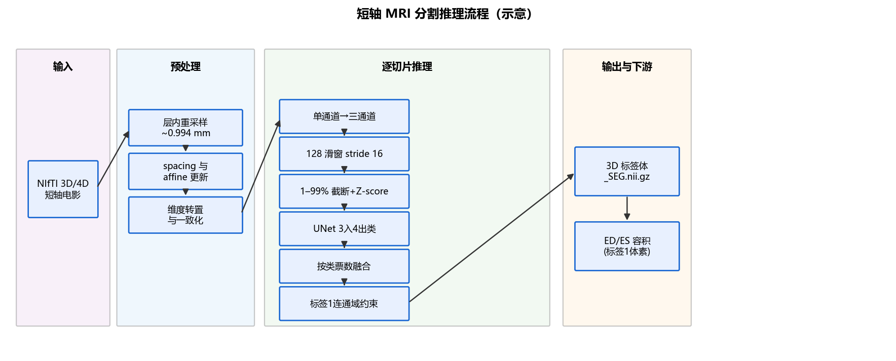

</div>

<p align="center"><strong>短轴 MRI 分割推理流程（示意）</strong></p>


| 参数 | 取值（以推理代码为准） |
|------|------------------------|
| 目标面内 spacing | 约 (0.994, 0.994) mm |
| Patch 尺寸 / 步长 | 128 / 16 |
| Patch 内归一化 | 1%–99% 截断 + Z-score |
| 推理 batch 大小 | 32 |
| SA 类别数 | 4 |
| 连通域后处理 | 以标签 1 最大连通域为核心；膨胀后与前景相交过滤（`keep_connected_to_lv`） |

**边界**：仓库无训练脚本；成稿前以数据字典为准写解剖命名。

---

### 2.3　由分割掩膜派生的几何量与 17 节段特征

**标签数据源**：除上表所列外，不完整行剔除，读入后与 `patient_id`、`seg` 合并。

**影像与特征**：`seg/` 下每名受试者 **≥10 帧** 有效分割；流水线提取 **心肌环几何量**（如 `Ldiast`、`Rdiast`、`kappa`、`Eclose`、`DeltaTheta`）与 **`seg01_amp`–`seg17_amp`**（分段命名与临床实践中的心肌分段模型一致[1]）；在 **训练集**上按事件/非事件节段均值差自动生成 **segment boost**，与基特征拼接后 **RobustScaler**[11]（仅训练拟合）。

**Scout 上界**（[`cohort_scout_summary.json`](cohort_scout_summary.json)）：seg **1223**；标签 **1477** 行；唯一患者 **1015**；特征成功 **1067**，失败约 **410**。其后问题是在该上界内如何做 **任务定义与入组**。

**两类已执行入组策略**（均在同一脚本体系中实现）：
- **主分析（≈320 策略）**：事件优先与各 cohort **配额**；在 **`time`≤1095 天** 子条件内对 **`endpoint`=1** 病例数设 **下限**（参数历史名 `min-events-3y`，**此处 1095 天仅作软件中的日历常数**），使可建模子集中 **事件（`endpoint`=1）比例相对升高**，以利于判别学习及方法学展示。
- **`--full-cohort`**：**标签×seg 可合并且 `patient_id` 去重** 的全可获得队列，**`endpoint`=1** 所占比例通常更低，学习任务更难。

这两条路径的差异 **在下文 §5.9 与第六章专门用定量与图示说明**，避免混淆「模型失效」与「任务变难（阳性占比变化）」。


---

### 2.4　统计与机器学习评估协议

**外层划分**（恒定）：
```text
train_test_split(test_size=0.25, stratify=endpoint, random_state=20260501)
```
**泄漏控制**：融合权重、树/MLP 超参 **仅由内层 CV/OOF 决定**；**所有用于临床复述的阈值** 均在 **训练 OOF 融合概率** 上确定后再用于 **同一固定外测**。流程示意如下。


<div align="center">

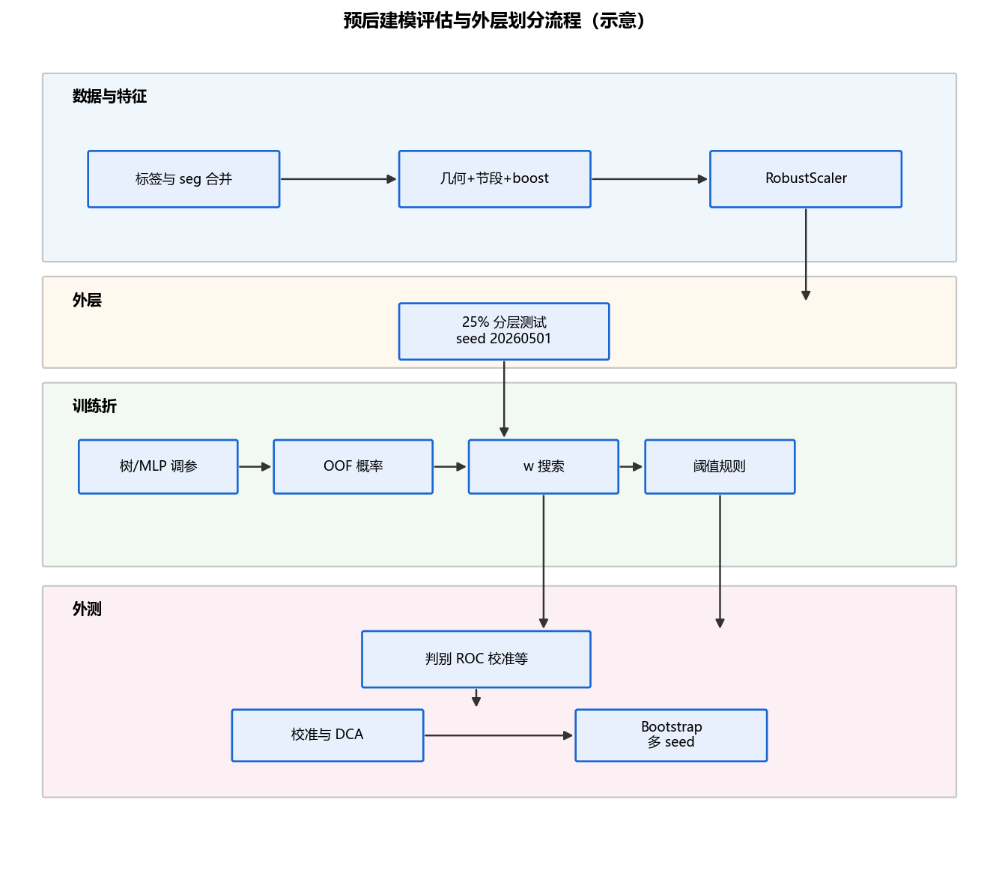

</div>

<p align="center"><strong>预后建模评估与外层划分流程（示意）</strong></p>


**Cox 轴**：三组协变量（基础 / 几何扩展 / 全特征）；C-index 与 time-dependent 图示按脚本实现[2][3][4]（本文为 horizon 二元代理，非 IPCW）。**判别轴**：**XGBoost**[9]（或 RF）、**浅层 MLP**，折内 **`0.4·AUC + 0.3·BA + 0.3·F1`（阈 0.5）**；OOF 搜融合权 **w**；AUC 含义见[14]。

**阈值规则（OOF 上定义）**：

| 规则 | 含义 |
|------|------|
| `max_balanced_accuracy` | 主规则：最大化 (Sens+Spec)/2 |
| `max_youden_j` | 最大化 Youden J |
| `conservative_high_specificity` | Sens≥0.75 约束下最大化 Spec |
| `aggressive_high_sensitivity` | Spec≥0.75 约束下最大化 Sens |

**校准与副业**：uniform 分层下的可靠性曲线[7]与 **DCA**[5]，并报告 **Brier 分数**[10] 等概率质量指标；可选用 **OOF isotonic**[8] 调整融合概率（`--oof-isotonic-calibration`）并导出 `_isotonic` 附图（不改变主文件名体系）。

本节不堆结果数；具体数字全部由 **第五章** 在对应实验步骤给出。


---

## 第三章 阶段一（中期）研究结果

多中心对齐、质控与体素/区域级模型节选；监督与指标与第四、五章**不对等**，并读前读**第六章**。

### 3.1　数据对齐、质控与早期深度/传统模型实验

实验过程

#### 数据处理

（1）图像帧数剔除

已获得三家知名医院的HCM患者心脏磁共振（CMR）影像数据集，该数据集包含患者基线CMR影像数据（.nii.gz格式）及随访终点的死亡结局信息（结局标签定义：存活=0，死亡=1）。原始影像数据存在显著的异质性：按心动周期时刻划分的影像帧数范围为5-35帧（其中25帧、30帧占比最高），且每帧影像按解剖层面自上而下切割的层数为6-17层不等，数据结构的不一致性给后续数据处理、特征向量生成和模型构建带来较大挑战。为统一数据结构，便于后续深度学习操作，需对原始心脏磁共振影像（.nii.gz 格式）进行规范化处理，我们制定了两种清洗方案。

第一种清洗方案核心是通过“删除冗余文件/图像层”，将数据统一为“25个文件+固定帧数”的标准格式，具体删除规则如表1所示。

规则说明：

-仅处理“原始文件数为25或30个”“单文件原始帧数为7-13帧”的文件夹，其余数据直接跳过，避免异常数据干扰；

-文件索引和图像层索引均从0开始（例如“第4个文件”对应原始排序的第5个文件）；

-最终所有输出数据均满足“25个文件+每个文件7帧”的统一格式，确保后续模型输入形状一致。

##### 表 1: 数据规范化删除规则表


| 规则类型 | 原始参数值 | 删除内容（索引从 0 开始） | 处理后结果 |
| --- | --- | --- | --- |
| 文件夹内文件删除 | 25 个文件 | 无（全部保留） | 25个文件（不变） |
|  | 30 个文件 | 第 4 、9、14、19 、24 个文件 | 25个文件（统一数量） |
| 单文件内图像层删除 | 7 帧 | 无（全部保留） | 7帧（固定帧数） |
|  | 8 帧 | 第 4 层（仅 1个） | 7帧（统一帧数） |
|  | 9 帧 | 第 3 、5 层（共 2个） | 7帧（统一帧数） |
|  | 10 帧 | 第 2 、4、7 层（共 3个） | 7帧（统一帧数） |
|  | 11 帧 | 第 2 、4 、6 、8 层（共 4个） | 7帧（统一帧数） |
|  | 12 帧 | 第 1 、3 、5、7 、9 层（共 5个） | 7帧（统一帧数） |
|  | 13 帧 | 第 1 、3 、5、7 、9、11 层（共 6个） | 7帧（统一帧数） |
第二种清洗方案新的清洗方式是对心脏核磁共振序列数据进行标准化处理，通过统一帧数（25帧）和切片数（7层）解决数据格式不一致问题。具体而言，对帧数不足 25的病人随机复制相邻帧补充， 帧数超过 25的按时间点匹配筛选；对切片数不足 7的复制指定层，超过 7的按物理位置匹配筛选，最终输出格式统一的NIfTI文件，为后续特征计算奠定基础。具体方式见下表。

##### 表 2:数据规范化筛选与补充规则表


| 数据类型 | 原始数量范围 | 处理目标 | 具体筛选 / 补充逻辑 | 核心原则 |
| --- | --- | --- | --- | --- |
| 帧数 | <22 帧 | 剔除 | - | - |
| 帧数 | 22-25 帧 | 统一为 25 帧 | 随机复制 1-3 帧，插入相邻位 置，重新命名保持时间序列连 续性 | 补充相邻帧以维持时间连续性 |
| 帧数 | >25 帧 | 统一为 25 帧 | 假设总扫描时间相同， 计算目 标时间点（25 帧均匀分布），选 择原始时间点中最接近的帧 | 按时间点匹配筛选，保留关键帧 |
|  | 6 层 | 统一为 7 层 | 随机选择第 i 层，复制到第 i+1 层， 同一病人所有帧的 i 值保持一致 | 复制相邻层以维持空间一致性 |
| 层数 | 7 层 | 保持 7 层 | 不做处理，作为标准化基准 | 以 7 层为空间标准参考 |
| 层数 | >7 层（如 8 、9、13 层） | 统一为 7 层 | 假设切片物理位置均匀分布， 计算目标 7 层位置，选择原始  切片中最接近的 7 层 | 按物理位置匹配筛选，贴近标准 |
这种做法的优势在于针对性强，紧密贴合需求， 能批量处理多病人数据并保留原始空间信息，同时通过相邻复制和位置匹配逻辑减少信息损失。

（2）异常图像的检测与删除

进行图像初步处理后，仍可能存在因图像分割错误导致的异常数据（如分割区域破碎、形状畸形、多连通块等）这类数据会干扰模型训练效果，需通过连通域分析和形状校验进行筛选，删除不合格的病例数据。因此我们便利用 skimage.measure 库进行异常图像的检测与删除，核心检测目标如下：

识别并标记因分割错误导致的异常影像，具体包括：

-目标区域存在多个大面积连通块（非单一完整区域）；

-目标区域面积过小（低于设定阈值）

-目标区域形状过于畸形（偏离正常心脏区域的圆度特征）。

关键参数设置  ：

##### 表 3:异常检测参数表


| 参数名称 | 取值 | 功能说明 |
| --- | --- | --- |
| min__area | 500 | 连通域最小面积阈值（像素数），低于该值判定为异常 |
| max__components | 1 | 最大允许连通块数量，超过1个大面积连通块判定为异常 |
| shape__threshold | 0.6 | 圆度阈值（范围 0-1），低于该值表示形状过于畸形 |
| 二值化阈值 | 0.5 | 影像二值化判断标准（大于 0.5视为有效区域） |
| 检测通道 | 第 0通道 | 仅校验矩阵第 0通道（可根据实际需求调整） |
最终获得更加完备的数据集。

#### 图像掩码处理

在规范化数据格式后， 需基于分割标签对原始影像进行掩码提取， 筛选出心腔心肌区域（标 签 1 和标签 2 对应的区域），为模型训练提供针对性输入。提取规则如下表：

##### 表 4:  图像掩码提取规则表


| 输出文件夹 | 掩码条件 | 提取区域 | 处理逻辑 |
| --- | --- | --- | --- |
| out__dir__1 | 分割标签 = 1 | 标签1对应心脏区域 | 仅保留该区域原始影像值， 其余位置置0 |
| out__dir__2 | 分割标签 = 2 | 标签2对应心脏区域 | 仅保留该区域原始影像值， 其余位置置0 |
| out__dir__1__2 | 分割标签 =1 或 2 | 标签1+2合并区域 | 仅保留两区域原始影像值， 其余位置置0 |
#### 数据读取与处理

#### 掩码提取后，需对目标区域影像进行统一分辨率处理和矩阵整合，将分散的.nii.gz 文件转换为深度学习模型可直接读取的 HDF5 格式（ .h5），确保输入数据的空间一致性和格式标准化。

因此，我们利用 SimpleITK 库实现影像重采样，确保物理尺寸不变的前提下调整像素分辨率，并制定了以下规则：

- 计算新间距：根据原始影像的尺寸和间距，推导目标分辨率下的新间距，避免图像拉伸或压缩；

- 插值方式：采用线性插值（sitk.sitkLinear），平衡重采样效率和图像细节保留；

- 保持空间信息：保留原始影像的原点、方向等空间参数，确保后续分析的坐标一致性。

最终用于构建四维矩阵： 整合 25 个文件的数据，获得形状为 (25, 256, 256, 7) 的矩阵（帧数 × 宽 × 高 × 帧数）， 并将四维矩阵存储为 HDF5 格式（ .h5）， 从而达到了空间一致性、格式标准化，使得矩阵质量可控。

#### 心腔部分区域深度学习与实验

经过数据预处理和质量筛选后， 基于高质量的心脏核磁影像矩阵数据， 构建 3D CNN（三维卷积神经网络） 模型[3]，实现疾病分类任务。核心流程包括数据划分、数据集构建、模型设计、训练优化及性能评估[4]。

数据准备与划分

数据关联与筛选：通过已有的患病不患病数据与清洗好的 HDF5 矩阵对应，作为深度学习的输入。

数据集划分：采用分层抽样方式将有效样本划分为训练集和测试集， 确保两类数据集的标签分布一致，避免数据偏倚，其中：

- 训练集占比： 80% （用于模型参数学习）；

- 测试集占比： 20% （用于模型性能评估）；

- 随机种子： ‘random__state=42’（保证划分结果可复现）。

3D CNN 模型设计

构建轻量级 3D CNN 模型（‘Simple3DCNN’），适配医学影像的三维特征提取需求， 模型结构如下表所示：

#### 模型设计说明  ：

- 特征提取：通过两层 3D 卷积层和池化层逐步提取影像的低级到高级特征， 3D 卷积可同时捕捉空间（宽 × 高）和时间（帧）维度的特征；

- 正则化：批归一化层（‘BatchNorm3d’）减少过拟合，加速训练收敛；

- 分类头：两层全连接层将高维特征映射到分类结果（2类输出，对应生存/死亡）。

多源数据融合训练

为提升模型泛化能力和数据利用效率， 将原有数据集（zhang__1）与新增数据集（RJ__1）进行融合，基于预训练模型参数继续训练，充分利用多源数据的特征互补性，优化模型分类性能, 达到数据扩充与模型复用的目的。

##### 表 5:  Simple3DCNN 模型结构表

| 层类型 | 层名称 | 核心参数 | 输出维度（输入： 7×25×256×256） |
| --- | --- | --- | --- |
| 3D 卷积层 | conv1 | 输入 7 通道，输出16通道， 卷积核3×3×3， padding=1 | 16×25×256×256 |
| 3D 批归一化层 | bn1 | 通道数 16 | 16×25×256×256 |
| 激活函数 | - | ReLU | 16×25×256×256 |
| 3D 最大池化层 | pool | 池化核 2×2×2 | 16×12×128×128 |
| 3D 卷积层 | conv2 | 输入16 通道， 输出32 通道，卷积核3×3×3，padding=1 | 32×12×128×128 |
| 3D 批归一化层 | bn2 | 通道数 32 | 32×12×128×128 |
| 激活函数 | - | ReLU | 32×12×128×128 |
| 3D 最大池化层 | pool | 池化核 2×2×2 | 32×6×64×64 |
| 全连接层 | fc1 | 输入：32×6×64×64，输出：64 | 64 |
| 激活函数 | - | ReLU | 64 |
| 全连接层 | fc2 | 输入：64，输出：2（两类分类） | 2 |
#### 结果分析

经过以上训练后，我们将模型保存，并在一个全新的数据集上进行检验，得到以下结果：

##### 表 6: 模型分类性能报告

| 类别 | 精确率 | 召回率 | F1 分数 | 支持样本数 |
| --- | --- | --- | --- | --- |
| Class 0 | 0.9337 | 0.9439 | 0.9388 | 731 |
| Class 1 | 0.2115 | 0.1833 | 0.1964 | 60 |
| 总体准确率 | — | — | 0.8862 | 791 |
| 宏平均 | 0.5726 | 0.5636 | 0.5676 | 791 |
| 加权平均 | 0.8789 | 0.8862 | 0.8825 | 791 |
混淆矩阵直观展示了模型的分类错误分布，行表示真实标签，列表示预测标签，具体结果如下表所示：

##### 表 7: 模型分类混淆矩阵

|  | Class 0（预测） | Class 1（预测） |
| --- | --- | --- |
| Class 0（真实） | 690（真阴性） | 41（假阳性） |
| Class 1（真实） | 49（假阴性） | 11（真阳性） |
#### 模型总准确率达0.8862，在总样本量为791的数据集中表现良好，然而却存在着较大类别差异，其中：

- Class 0 样本（731 个）的精确率和召回率均接近0.94，说明模型对该类样本的识别能力强，分类效果优异；

- Class 1 样本（60 个）的召回率仅为0.1833，精确率为0.2115，表现较差，

说明模型仍存在着模型学习不充分的问题，其原因可能是数据集中本身 Class 为 1（患病）的数据量过少，因而需要针对 Class 1 进行学习，以提升 call__back 率，从以下流形学习图中我们也可以得到这一点：


<div align="center">

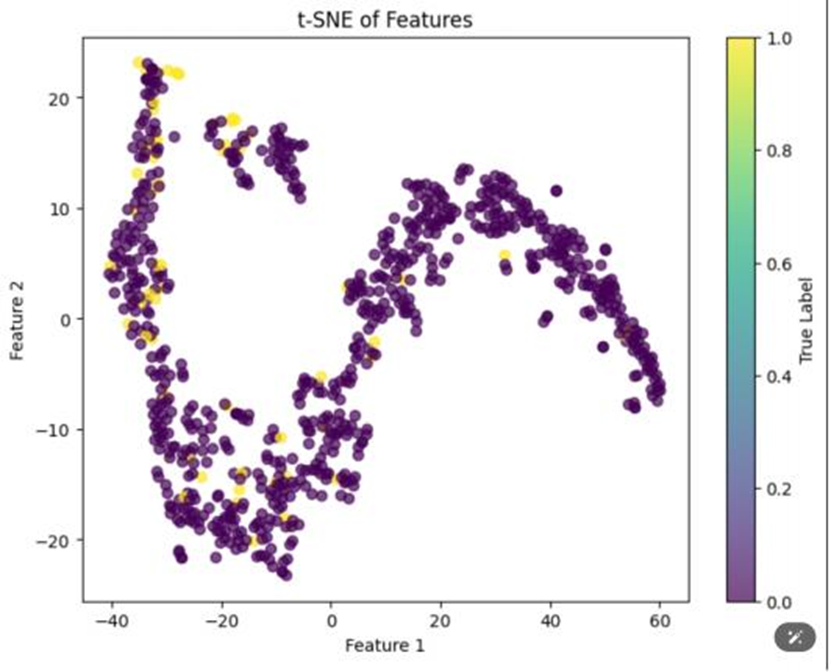

</div>

<p align="center"><strong>图 1</strong></p>


##### 图 1: t-SNE特征

#### 模型优化

类别加权损失优化训练：通过类别权重计算，以“最多样本数/各类样本数”为公式，得到两类的权重，并以“多数类样本数/少数类样本数”的比例分配权重确保少数类权重更高。最后将权重转换为 PyTorch 张量并移至训练设备，用于损失函数初始化。以下是训练配置：

##### 表 9: 类别加权损失训练配置表


| 配置项 | 参数/逻辑 | 功能说明 |
| --- | --- | --- |
| 损失函数 | CrossEntropyLoss(weight=weights) | 引入类别权重的交叉熵损失 |
| 训练轮数 | 6 轮 | 较之前增加 1 轮，确保模型充分学习加权特征 |
| 评估输出 | 每轮输出分类报告 + 混淆矩阵 | 实时监控少数类性能变化 |
| 优化器 | Adam（lr=1e-4） | 保持学习率稳定，避免权重震荡 |
再次检验后发现，模型对少数类（Class 1）的召回率和 F1分数得到改善，但是准确率仍不高，具体分类报告和混淆矩阵如下：

##### 表 10: 优化后补充分类性能报告

| 类别 | 精确率 | 召回率 | F1 分数 | 支持样本数 |
| --- | --- | --- | --- | --- |
| Class 0 | 0.9769 | 0.6936 | 0.8112 | 731 |
| Class 1 | 0.1765 | 0.8000 | 0.2892 | 60 |
| 总体准确率 | — | — | 0.7016 | 791 |
| 宏平均 | 0.5767 | 0.7468 | 0.5502 | 791 |
| 加权平均 | 0.9162 | 0.7016 | 0.7716 | 791 |
表11: 优化后补充混淆矩阵

|  | Class 0（预测） | Class 1（预测） |
| --- | --- | --- |
| Class 0（真实） | 507（真阴性） | 224（假阳性） |
| Class 1（真实） | 12（假阴性） | 48（真阳性） |
#### 四个局部子区域的深度学习与实验

在完成心肌分割区域提取后， 本研究进一步采用基于区域再划分的方式对数据进行增强， 将每个心肌区域划分为四个局部子区域。针对生成的高维一维特征向量，本研究分别构建了多层感知机（MLP）模型与一维卷积神经网络（1D CNN）模型进行分类学习。


<div align="center">

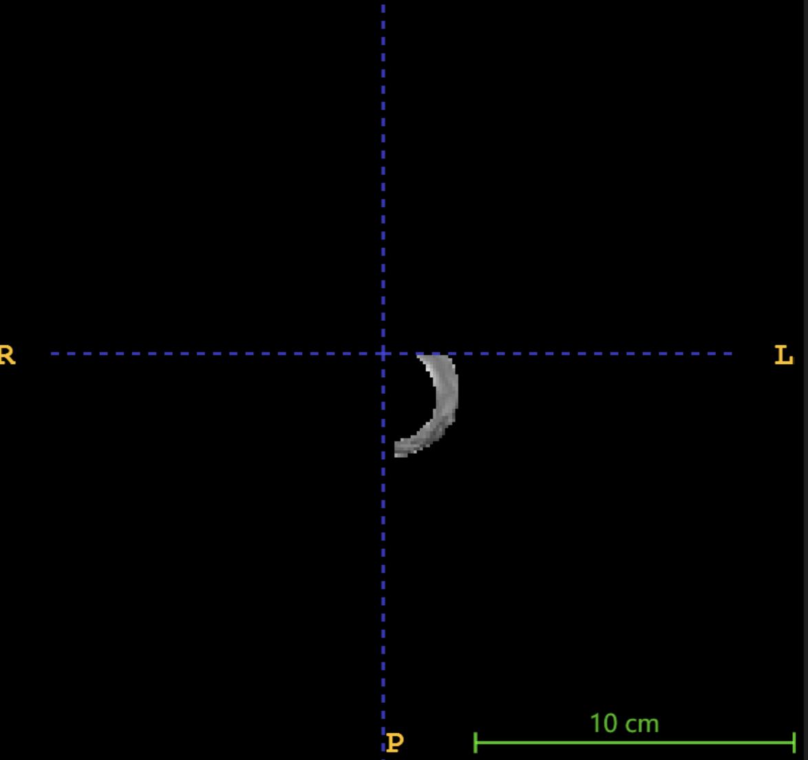

</div>

<p align="center"><strong>图 2</strong></p>


<div align="center">

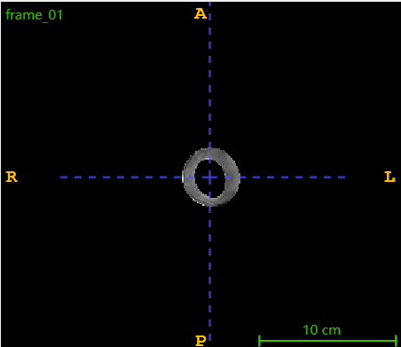

</div>

<p align="center"><strong>图 3</strong></p>


图2： 完整心肌图像（左）和局部子区域心肌图像（右）

心肌区域四等分策略的合理性与优势

为了提高特征表达能力，本研究在已有心肌分割基础上， 对心肌区域进行四等分处理。这一策略的优势体现在以下三点：

-增强局部病变敏感性心肌病变往往呈局灶性发展，例如：

•  局部纤维化

•  局部灌注不足

•  局部壁运动异常

若使用完整心肌整体特征进行学习，则局部病灶信号可能被全局特征平均化掩盖。切分后每一子区域能够：

•  放大病灶区域的统计与纹理差异

•  提升模型对早期微小变化的识别能力

-扩大样本规模，提高深度学习有效性切分为四片后：

N(total) = 4 × N(patients)

对深度学习模型而言，样本数量提升带来：

•  降低过拟合风险

•  提升泛化能力

•  加速模型收敛

特别是在医学影像数据通常样本有限、阳性病例更稀缺的情况下尤为重要。

提高对多中心数据差异的鲁棒性不同医院在以下方面可能存在差异：

表12：差异性


| 设备/协议差异 | 对影像影响 |
| --- | --- |
| 扫描序列不同 | 纹理分布差异 |
| 分辨率与 FOV 不一致 | 全局结构尺度变化 |
| 噪声特性差异 | 强度统计变化 |
使用整体特征时会导致模型对中心差异敏感， 四等分后输入特征更关注局部模式，不容易被全局质量偏差影响。从而能够：

•  提升跨中心一致性

•  更适合真实临床环境部署

特征构建与输入形式

提取的每个子区域包含以下信息：

•  统计特征：均值、标准差、中位数、最大值、最小值

•  纹特征：基于灰度共生矩阵的对比度、能量、相关性等

•  深度特征：通过轻量级 CNN 提取的语义特征

最终每个样本输入网络形式为一条一维特征向量，其中最后一维为分类标签（endpoint）。按照 8:2 的比例划分训练集与验证集。

#### 模型结构设计

1.  MLP 模型采用三层全连接结构，使用 Batch Normalization 和 Dropout 防止过拟合， 网络末端采用 Sigmoid 激活函数实现二分类输出。

2.  1D CNN  模型将特征向量视为一维序列输入，一维卷积层提取局部相关结构，结合全局池化实现特征压缩，提高模型泛化能力。

##### 表 13: 模型结构比较


| 特点 | MLP | 1D CNN |
| --- | --- | --- |
| 输入 | 一维向量 | 一维序列 |
| 特征学习重点 | 全局统计模式 | 局部空间依赖关系 |
| 参数量 | 较小 | 中等 |
| 对数据量依赖 | 较弱 | 较强 |
#### 模型性能评估

通过 GPU 加速训练，模型在验证集上获得如下结果：

##### 表 14: MLP 模型性能


| 指标 | 数值 |
| --- | --- |
| Accuracy | 0.8741 |
| Recall | 0.22 |
| Precision | 0.3179 |
| F1 Score | 0.2455 |
| AUC | 0.6966 |
##### 表 15:  1D CNN 模型性能


| 指标 | 数值（示例） |
| --- | --- |
| Accuracy | 0.1454 |
| Recall | 0.998 |
| Precision | 0.1069 |
| F1 Score | 0.1931 |
| AUC | 0.6735 |
结果显示两个模型均具备基本区分能力，其中 1D CNN 在正例识别能力上略差于 MLP。

结果可视化


<div align="center">

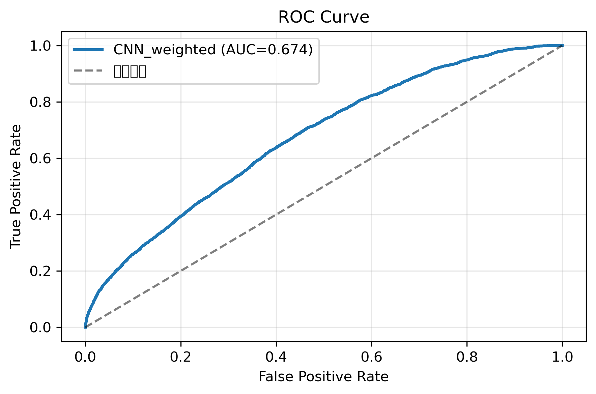

</div>

<p align="center"><strong>图 4</strong></p>


<div align="center">


</div>

<p align="center"><strong>图 5</strong></p>


<div align="center">

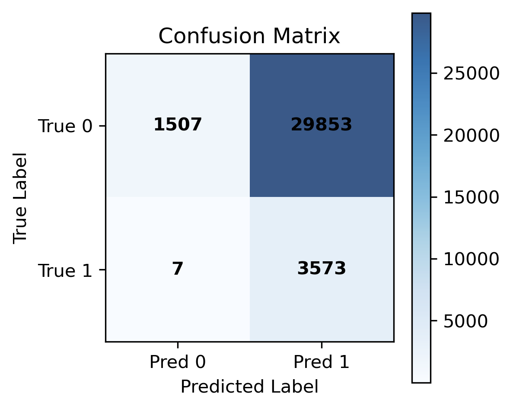

</div>

<p align="center"><strong>图 6</strong></p>


<div align="center">

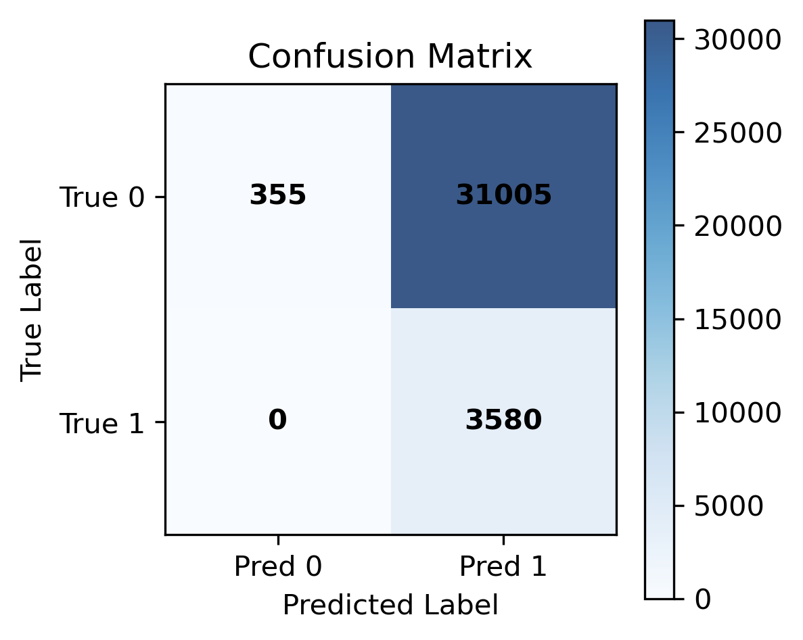

</div>

<p align="center"><strong>图 7</strong></p>


图3: ROC曲线与混淆矩阵

对于心腔部分的机器学习分析

我们先分析单个病人， 针对单个病人的标准化影像数据， 提取面积数据、质心轨迹及光流图等关键运动特征，同时通过可视化方式直观呈现个体心脏结构与运动规律。

获取的数据如下图表示：


<div align="center">

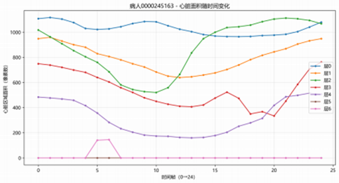

</div>

<p align="center"><strong>图 8</strong></p>


##### 图 4:面积变化图


<div align="center">

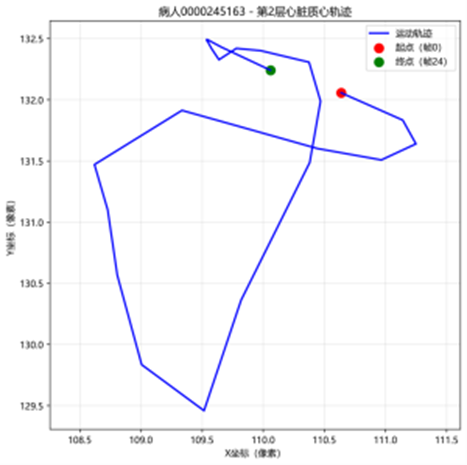

</div>

<p align="center"><strong>图 9</strong></p>


<div align="center">

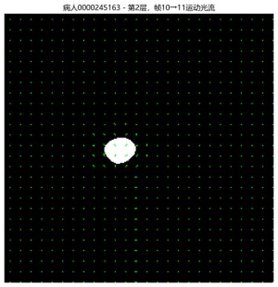

</div>

<p align="center"><strong>图 10</strong></p>


(a) 质心轨迹图                                        (b) 光流图

##### 图 5:  关键运动特征可视化图

注：光流图（3b) 为帧 10→ 11 的运动矢量，绿色箭头标注运动方向。

群体特征分析：

在个体特征提取的基础上， 进一步汇总所有病人的特征数据，形成群体特征体系，核心功能是生成群体特征总表，并通过 PCA 降维可视化群体间的差异，筛选关键特征。

关键输出包括两部分：

-群体特征总表: 涵盖各层的面积均值、面积波动、面积变化率等多维度特征，

-可视化图表：PCA 群体分布图（x 轴：主成分 1，y 轴：主成分 2，绿色点：存活，红色点： 死亡），直观展示正常与患病群体的特征差异；Top8 特征重要性图（x 轴：特征重要性，y 轴：特征名，蓝色条形图），明确对疾病判定最关键的核心特征，为后续模型训练提供特征筛选依据。

#### 模型训练——随机森林[5]

基于特征工程提取的核心特征，进入模型构建阶段，通过初始模型训练、优化调整， 逐步提升模型的疾病判定能力，重点解决类别不平衡问题，满足临床漏诊控制需求。

基于 Top5 核心特征训练随机森林模型，针对原始数据中正常与患病样本数量失衡的问题， 采用数据平衡策略优化训练集分布，提升模型对患病样本的识别能力。获得如下结果：

##### 表 16: 模型核心性能评估表


| 评估指标 | 数值 |
| --- | --- |
| 折交叉验证 AUC | 0.6474 |
| 测试集 AUC | 0.6808 |
| 测试集准确率 | 88.71% |
##### 表 17:  测试集分类报告表

| 类别 | 精确率 | 召回率 | F1 分数 | 支持样本数 |
| --- | --- | --- | --- | --- |
| 正常 | 0.96 | 0.92 | 0.94 | 59 |
| 患病 | 0.17 | 0.33 | 0.22 | 3 |
| 总体准确率 | — | — | 0.89 | 62 |
| 宏平均 | 0.565 | 0.625 | 0.58 | 62 |
| 加权平均 | 0.921 | 0.892 | 0.906 | 62 |
##### 表 18: 优化后补充混淆矩阵

|  | Class 0（预测） | Class 1（预测） |
| --- | --- | --- |
| Class 0（真实） | 507（真阴性） | 224（假阳性） |
| Class 1（真实） | 12（假阴性） | 48（真阳性） |
#### 模型优化：类别权重 + 阈值调整

针对初始模型中患病样本召回率偏低的问题，进一步优化模型性能。通过调整类别权重（提升患病样本的模型关注度）和预测阈值，我们重点提升患病样本召回率，降低临床漏诊风险。

我们得到优化后结果如下：

##### 表 7: 模型优化前后核心指标对比表


| 评估指标 | 优化前 | 优化后 |
| --- | --- | --- |
| 患病样本召回率 | 0.3333 | 0.00 |
| 整体准确率 | 0.8871 | 0.9194 |
| AUC | 0.6808 | 0.5904 |
##### 表 8: 优化后模型分类报告表

| 类别 | 精确率 | 召回率 | F1 分数 | 支持样本数 |
| --- | --- | --- | --- | --- |
| 正常 | 0.95 | 0.97 | 0.96 | 59 |
| 患病 | 0.00 | 0.00 | 0.00 | 3 |
| 总体准确率 | — | — | 0.9194 | 62 |
| 宏平均 | 0.475 | 0.485 | 0.480 | 62 |
| 加权平均 | 0.903 | 0.922 | 0.913 | 62 |
#### 模型验证与阈值分析

为确保模型的泛化能力与临床实用性，需通过跨数据集验证与全阈值范围分析， 筛选最优应用参数，验证模型在不同场景下的稳定性与可靠性。我们使用独立的 RJ__1 数据集对优化后模型进行验证，评估模型在全新数据上的泛化能力，确保模型不局限于训练数据，具备实际临床应用价值。

最终获得如下结果：

##### 表 19: 验证集分类报告表

| 类别 | 精确率 | 召回率 | F1 分数 | 支持样本数 |
| --- | --- | --- | --- | --- |
| 正常 | 0.83 | 0.99 | 0.90 | 543 |
| 患病 | 0.44 | 0.04 | 0.07 | 113 |
| 总体准确率 | — | — | 0.83 | 656 |
| 宏平均 | 0.64 | 0.51 | 0.48 | 656 |
| 加权平均 | 0.76 | 0.83 | 0.76 | 656 |
##### 表 20: 验证数据混淆矩阵

|  | 正常（预测） | 患病（预测） |
| --- | --- | --- |
| 正常（真实） | 538（真阴性） | 5（假阳性） |
| 患病（真实） | 109（假阴性） | 4（真阳性） |
阈值分析代码：不同阈值下准确率、召回率

遍历全阈值范围，分析不同阈值下模型的准确率、召回率、精确率等关键指标，筛选既能满足临床漏诊控制需求，又能平衡误诊风险的最优阈值。


<div align="center">

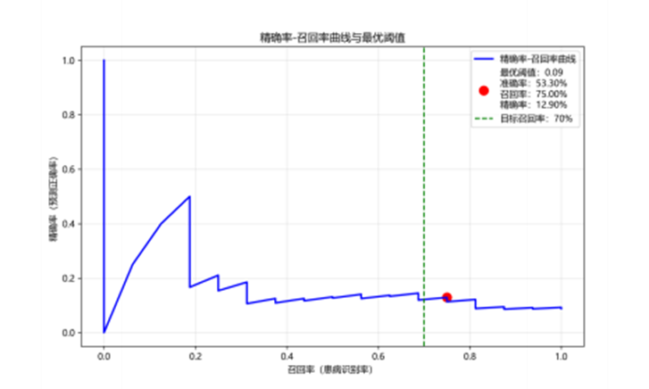

</div>

<p align="center"><strong>图 11</strong></p>


##### 图 6: 面积变化图

最终优化模型代码：扩展特征+XGBoost

结合前期验证与阈值分析结果，进行最终模型优化，核心功能是扩展特征维度至 12 维，采用性能更优的 XGBoost 算法重新训练模型，并基于最优阈值确定最终模型参数，实现漏诊率与整体性能的平衡。

##### 表 21: 最终模型核心性能评估表（最优阈值 =0.09）

| 评估指标 | 数值 | 备注 |
| --- | --- | --- |
| 最优阈值 | 0.09 | 核心应用参数 |
| 准确率 | 53.30% | - |
| 召回率（患病样本） | 75.00% | 目标 70% |
| 精确率（患病样本） | 12.90% | - |
| F1 分数 | 0.2202 | - |
| AUC | 0.6280 | - |
获得以下结果：

##### 表 22: 最终模型分类报告表（最优阈值 =0.09）

| 类别 | 精确率 | 召回率 | F1 分数 | 支持样本数 |
| --- | --- | --- | --- | --- |
| 正常 | 0.96 | 0.51 | 0.67 | 166 |
| 患病 | 0.13 | 0.75 | 0.22 | 16 |
| 总体准确率 | — | — | 0.53 | 182 |
| 宏平均 | 0.54 | 0.63 | 0.44 | 182 |
| 加权平均 | 0.88 | 0.53 | 0.63 | 182 |
##### 表 23: 最终模型混淆矩阵（最优阈值 =0.09）

|  | 正常（预测） | 患病（预测） |
| --- | --- | --- |
| 正常（真实） | 85（真阴性） | 81（假阳性） |
| 患病（真实） | 4（假阴性） | 12（真阳性） |
#### 总结与反思

虽然本研究已完成数据增强、特征构建与模型训练，但仍存在以下不足，有待进一步改进：

##### 表 24:  现有问题、原因分析与改进方向


| 存在问题 | 原因分析 | 改进方向 |
| --- | --- | --- |
| 数据切分导致特征更为稀疏 | 大量心肌结构信息丢失 | 采用更合理的区域划分方式（如解删去分割更为不好的第一层） |
| 特征矩阵占用空间大， 存取耗时 | 稀疏高维直接存储不高效 | 使用压缩存储、特征降维（PCA、AE） |
| 阳性样本比例低（数据不平衡） | 模型偏向预测负例 | 类别权重、SMOTE、GAN 过采样等 提升正样本可学习性 |
| 现有特征可区分性不足 | 手工统计+基础纹理不足以体现病灶 | 引入更复杂深度特征选取策略 |
| 多中心域差异影响 | 成像条件不同影响特征一致性 | 引入领域自适应、归一化策略 |
阶段性总结  本阶段研究完成了基于心肌分割区域再处理的深度学习、机器学习、流行特征等分类模型搭建，实现了数据增强与 GPU 加速训练，并获得具备应用潜力的初步预测结果。模型已经具备初步智能识别能力，但性能距离临床需求仍有差距，下一阶段重点将放在提升特征表达能力和正例识别性能上，重点改进样本不平衡问题与特征学习能力，以进一步提升模型稳定性与临床价值。

下一阶段将根据图像流形特征进行流形学习，并与以上模型结构进行对比整合，从中找到最为合理的判断方式。

#### 参考文献：

-, H.C., -, G.H., -, G.P., -, C.K.G., & -, R.S.P. (2025). Physiological and Pathological Hypertrophic Cardiomyopathy. International Journal For Multidisciplinary Research, 7(1). https://doi.org/10.36948/ijfmr.2025.v07i01.34963

Li, L., Gao, J., Liu, X., Chen, B.-X., Su, P., & Xie, B. (2024). Tissue-level evidence of fibroblast activation protein inhibitor imaging in hypertrophic obstructive cardiomyopathy: a case series. European Heart Journal - Case Reports, 8(5). https://doi.org/10.1093/ehjcr/ytae189

Zhou, S. K., Greenspan, H., Davatzikos, C., Duncan, J. S., Van Ginneken, B., Madabhushi, A., Prince, J. L., Rueckert, D., & Summers, R. M. (2021). A Review of Deep Learning in Medical Imaging: Imaging Traits, Technology Trends, Case Studies With Progress Highlights, and Future Promises. Proceedings of the IEEE, 109(5), 820–838. https://doi.org/10.1109/jproc.2021.3054390

Tian, H. (2025). Progress in the application of deep learning in medical image recognition. Applied and Computational Engineering, 135(1), 10–18. https://doi.org/10.54254/2755-2721/2025.20964

Katzmann, A., Muehlberg, A., Suehling, M., Norenberg, D., Holch, J. W., & Gross, H.-M. (2020). Deep Random Forests for Small Sample Size Prediction with Medical Imaging Data. 2020 IEEE 17th International Symposium on Biomedical Imaging (ISBI), 1543–1547. https://doi.org/10.1109/isbi45749.2020.9098420
中期回答「多中心张量能否进 3D CNN/区域网络与传统 ML」及「Rare-event 如何制约学习」→ 需流形归一（路径一）与可对终点的预后协议（路径二）。两路径阶段二内**并行**。


---

## 第四章 阶段二研究结果（一）：形状流形与 2D+t 运动学

阶段二路径一（合作者并行）：Kendall 形状空间 + 2D+t，讨论相对运动学与跨壁表型。与第五章 **`endpoint`** 预后**不同任务、不同指标**。


### 4.1　Kendall 形状空间中的 2D+t 运动学与跨壁分解（合作者，赵）

域移下欧氏标量不稳：轮廓/极坐标 → 形状流形 → 2D+t，比较存亡组内膜、外膜与跨壁（图 12–23）；重在运动学解读，**非**第五章 AUC 同构任务。

> 本节 **表 1** 为基线表，与第五章「表 1–7」无对应关系。


李佳澍

引言与多中心队列构建

传统几何形态学评估高度依赖欧氏空间内的绝对室壁厚度，但在多中心临床实践中，不同核磁扫描仪（如 1.5T  与 3.0T）的成像协议及像素物理间距存在显著差异，绝对距离度量极易产生严重的域偏移（Domain Shift）。为提取独立于绝对影像分辨率的病理运动学特征，本研究构建了来自三家独立医疗中心的大规模短轴 CMR 影像数据集。原始 NIfTI 分割掩码严格定义心内膜（强度 1）与心外膜（强度 2），覆盖完整心动周期的 25 帧，其多中心分布基线及人口统计学特征详见表 1。

表 1: 多中心 CMR 影像队列基线特征与融合分布概况

| 数据来源 (中心/队列) | 原始数据目录 | HCM 生存组 (0) | HCM 死亡组 (1) | 合计 |
| --- | --- | --- | --- | --- |
| Hospital 1 (Zhang) | ori_cine_zhang_nii | ~ 320 | ~ 25 | ~ 345 |
| Hospital 2 (ME) | ori_cine_me_nii | ~ 260 | ~ 23 | ~ 283 |
| Hospital 3 (RJ) | RJ_az_original_nii | ~ 77 | ~ 77 | ~ 154 |
| 融合验证池 | Combined_All | 657 | 125 | 782 |
流形分析与数据处理

形态学实体边缘提取

在微分几何分析中，建立严格的同源点对应，使得病人心脏严格对齐，这映射有效性的先决条件。传统基于像素掩码的直接提取极易陷入“环形嵌套”歧义，导致内外膜重采样时发生锯齿状的时空漂移错位，造成图像数据获取扭曲与错位[17]。为此，本研究引入了基于布尔异或运算与形态学腐的实体边缘提取算法。通过将心肌和心腔（intensity 1 和 0）在逻辑域合并为实心连通域，并以此剥离出病人心肌内外膜像素值。为克服重度 HCM  患者收缩期心腔极度闭塞引发的拓扑断裂[18]，即内外膜图像分割不完整，不连续的问题，我们下调有效像素阈值至 12，并设定最大容忍极角缺口为 120◦，从而在时序遍历中自适应地实现了心尖/心底残缺层向核心中间层的 n → m（即从n层通过删除问题层转化为m层） 降维过滤。

在取点方面，为了避免等间距取点因为心脏形变而带来的锯齿状边缘，损失各点之间对应

关系，导致滑动错位，我们选择计算边界簇的几何质心并依照几何质心为原点构建极坐标系，将

1

真实极角归一化至 [0, 1] 连续空间，并使用了窗口为 3 的移动平均卷积滤波对读取的点进行调整，从而获得了平整的边缘数据。

此时我们提取到的数据对于每一层来说是一个 200 维的向量，由内膜与外膜的向量直接拼接而成，其中前100维表示心脏内膜50个极坐标点对应的x和y值，后100维表示心脏外膜50个极坐标点对应的x值和y值。对于每一个case来说，我们获得了具有25个时刻（帧）的每一个时刻具有m层的200维数据，共计m*25个

为规避 Z 轴由于憋气深度不同或者是病人突然移动引起的层间错切伪影，，对每一层的外膜图像求取质心（选取外膜是因为心脏外膜具有稳定性），并且将内、外膜点集同时减去质心坐标，拉回到坐标原点，从而确保每一层心脏切片在 25 帧的尺度下时序对应与心脏整体性。

2.2 Kendall 形状流形与切空间对数映射

为消除心脏胸腔内的宏观位移及跨中心分辨率鸿沟，减少不同医院因为核磁共振仪参数不同那而导致的图像大小等的不同，去除非病理性的影响因素，我们将其映射至 Kendall  形状空间，并执行正交普鲁克（Orthogonal Procrustes Analysis）分析，通过去中心化消除平移群 T (2)  并求解最优旋转矩阵 R ∈ SO(2)。而在尺度归一化上，我们选取每个病人第一帧心外膜（选取外膜是因为心脏外膜具有稳定性）的范数作为局部绝对标尺，对内外膜坐标同步进行除法归一化，保证所有图像都在统一的尺度之下，消除了量纲。

成功映射后，我们将高维速度向量场正交解耦为内膜分量 vendo(t) 与外膜分量 vepi(t)，这两个各 50 维，其相对跨壁差异轨迹可定义为 δz(t) = vendo(t) − vepi(t)。提取其局部测地线距离

∥δz(t)∥2，可以获得不依赖方向的内外壁差异幅度。

针对心脏的整体性，我们选用了自下而上的生物力学加权积分策略。鉴于不同心室节段的

运动做功大小呈非均匀分布，策略提取各层外膜像素面积 Az 作为生物力学权重，从而将全局动态轨迹定义为 ∆(t) = ∑(Az · ∥δz(t)∥2)/ ∑ Az。[19][20]这种方式，既在一定程度上规避了三维层间

空间相关性不足，又依据真实的解剖质量比例，在较小损失下保留了局部病变对全心室泵血功能的代偿与拖累效应。

此时我们获得的便是一个S（t）的流行曲线，每一个点是由200维数据降维而成，t为每一个为病人所对应的25帧变化。

由于S（t） 属于非线性的黎曼流形上，无法直接进行代数运算，因此我们构建了选取心动周期轨迹的平均形态 S¯ 并将其作为流形运动的起始位置，利用对数映射的一阶泰勒近似 v(t) ≈ S(t) − S¯，将非线性静态轨迹正式投影至平坦切空间 TS¯Σ 的形变速度向量场中，获得统一的度量。这本质上是进行了均值投影，提取到了空间的离散度。我们将这个投影结果命名为2D+t图像

3

流形映射与图像结果分析

不同于传统仅关注局部静态厚度的解剖学评估，本研究发现：HCM 致死性心肌重构退化并非单纯的局部室壁增厚。为了精准锁定这些致死性畸变的物理源头，本研究将复杂的左心室运动学拓扑，系统性解耦为内膜、外膜及跨壁三大独立参照系进行深度破译。

3.1 参照系多维度解耦与独立流形映射

为解决HCM死亡组与HCM存活组同参数对比分析与特异性分析的需求：我们通过联合全队列残差执行全局 PCA 构建统一的三维相空间，计算平均 3D 极限环以量化宏观偏离度；其次，对HCM生存组与HCM死亡组分别执行独立子流形逆映射，将抽象的正交特征基底还原为二维物理形变场，以此破译隐藏在数据背后的致死性生物力学法则。

3.2 心内膜绝对动力学 (Endocardial Kinematics)：致死性心腔绞杀


<div align="center">

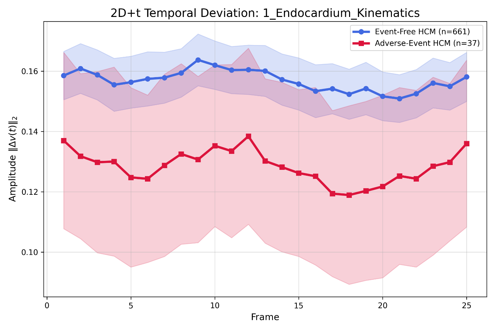

</div>

<p align="center"><strong>图 12</strong></p>


心内膜的绝对运动轨迹直接决定了左室流出道的通畅性。对内膜域的 2D+t 时序偏离度曲线进行分析，生存组（n = 661）的宏观振幅始终稳定在较高水平（∼ 0.16），表现出良好的向心收缩代偿能力；而死亡组（n = 37）的振幅曲线发生了全局性塌陷（0.12 ∼ 0.14），揭示了重症患者内膜运动的高度受限与极度僵硬。

在基于全局坐标重建的平均3D相空间中（即PCA结果），这种动力学差异被进一步放大：生存组的内膜平均轨迹形成了一个高度收敛、致密的引力子结构（蓝线）；而死亡组的平均轨迹则呈现出拓扑发散与轨道偏移（红线），在收缩期激增出极端的畸变轨迹。


<div align="center">

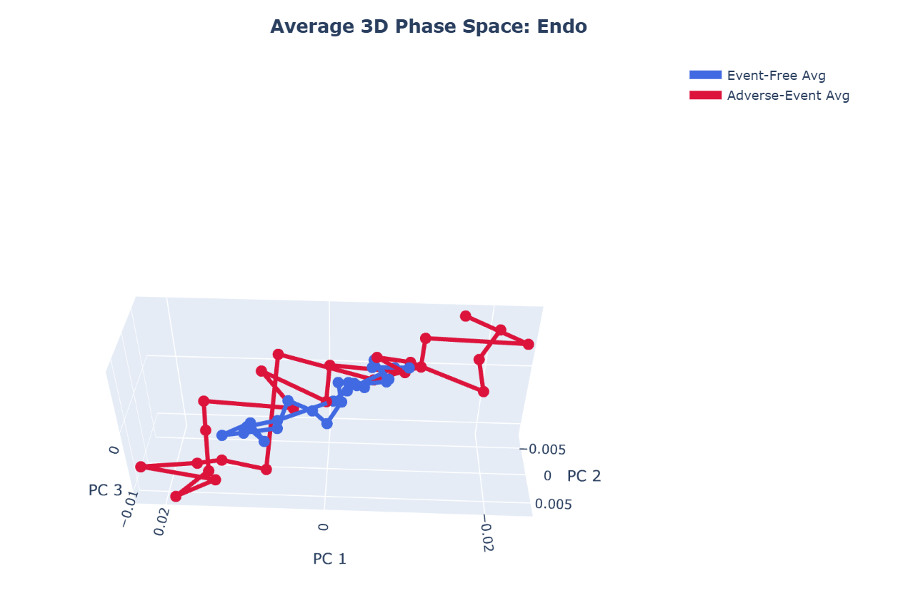

</div>

<p align="center"><strong>图 13</strong></p>


通过独立子流形逆映射提取的本构形变场解释了这一崩溃的物理元凶：

生存组内膜主导法则：其第一主成分（PC1，方差占比 25.7%）呈现为相对均匀的向心性收缩向量（蓝色箭头），表明心肌虽有肥厚，但仍维持着协调的流体动力学泵血边界。


<div align="center">

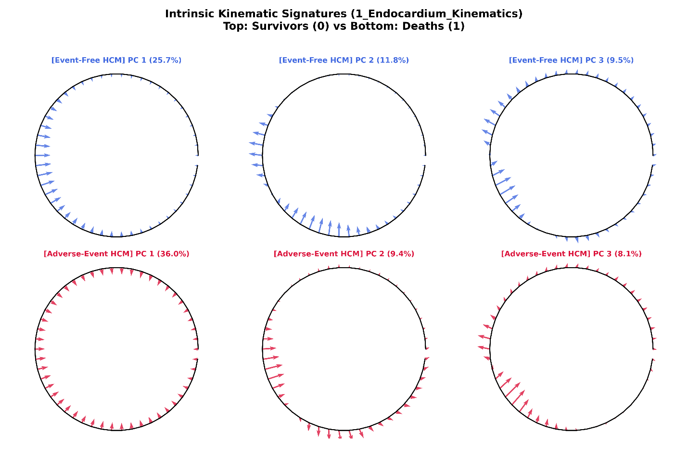

</div>

<p align="center"><strong>图 14</strong></p>


死亡组内膜主导法则：死亡组的 PC1 解释方差增至 36.0%，且其物理向量场彻底异化。极度肥厚的室间隔（左侧）与下壁（底部）呈现出非对称的向内侵入，向量直插圆心。这种特异性的，直接导致了心腔内血流的物理阻断，是诱发血流动力学梗阻[21]与猝死的一大原因

3.3 心外膜绝对动力学 (Epicardial Kinematics)：失代偿性外膨与约束丧失

心外膜运动通常受到心包及周边组织的生理约束，反映了心脏的整体刚体位移。外膜域的

2D+t 与时序分析同样显示，死亡组外膜的全局运动幅度被显著压抑。


<div align="center">

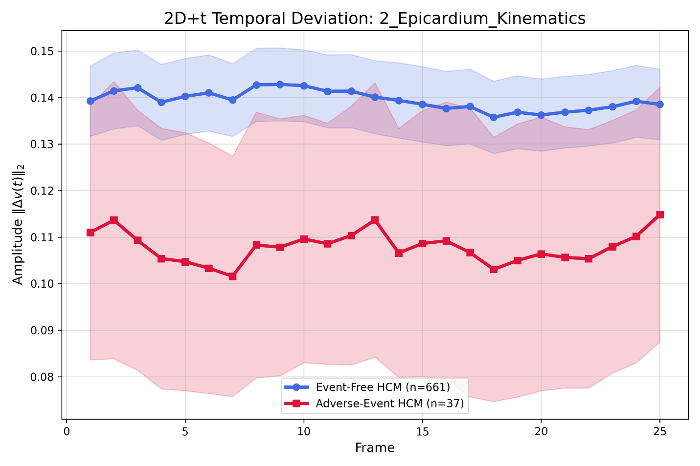

</div>

<p align="center"><strong>图 15</strong></p>


<div align="center">

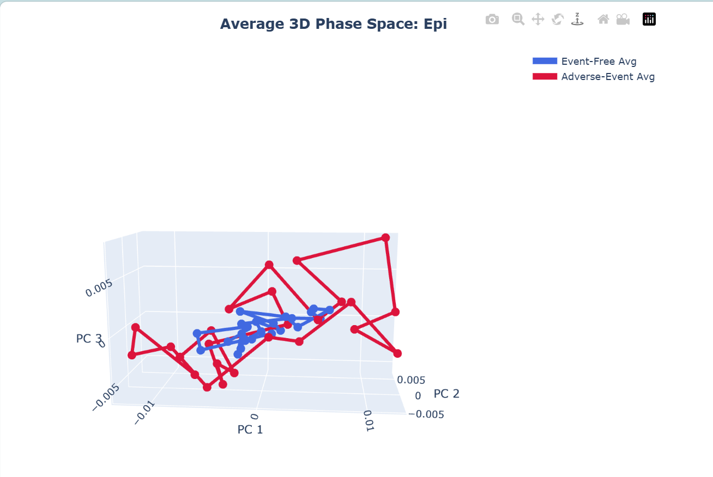

</div>

<p align="center"><strong>图 16</strong></p>


死亡组的PCA平均轨迹也更为发散。

在空间形变场的逆向映射中，外膜域揭示了与内膜截然不同的次生灾害机制：

生存组外膜特征：其前三大主成分的形变向量均相对微弱，且多顺应圆周切线或轻微向内，表明心脏外部结构依然保持着稳定的生理锚定与刚体约束。

死亡组外膜特征：在死亡组的次要变形基底中（如 PC2 14.7% 与 PC3 10.9%），左下侧壁出现了密集且显著的“向外、向下”放射状刺出向量（红色箭头）。结合内膜域的发现，我们认为：由于内膜发生了极端的闭塞与梗阻，左室内高压无法通过主动脉瓣释放，强大的腔内异常应力突破了受损心肌的拉伸极限，导致心脏外壳在局部发生反生理的滑移与代偿性外膨。[22]


<div align="center">

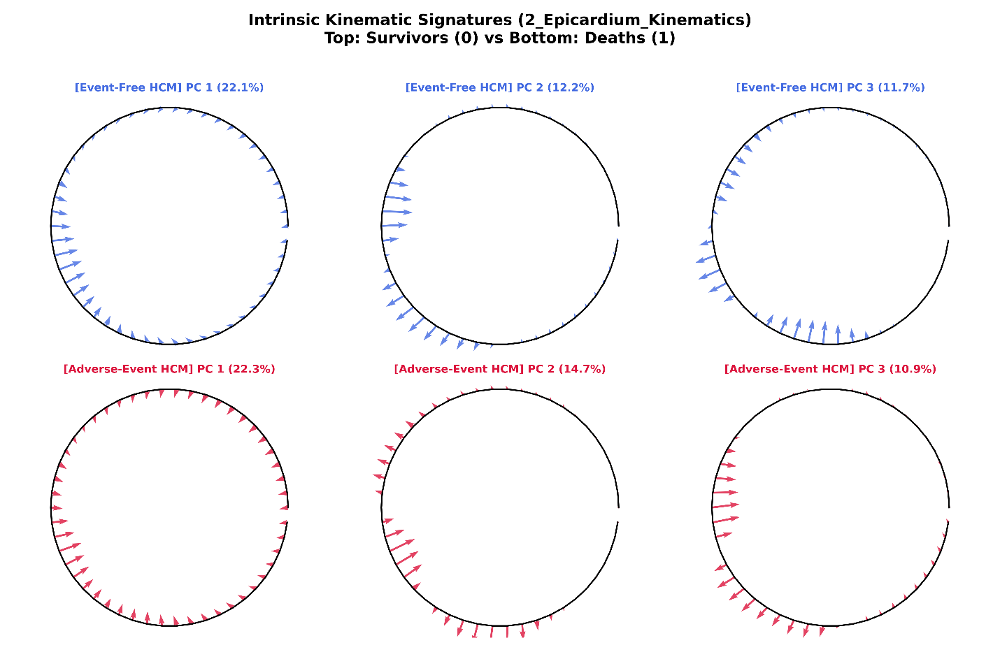

</div>

<p align="center"><strong>图 17</strong></p>


3.4 跨壁运动学发散度


<div align="center">

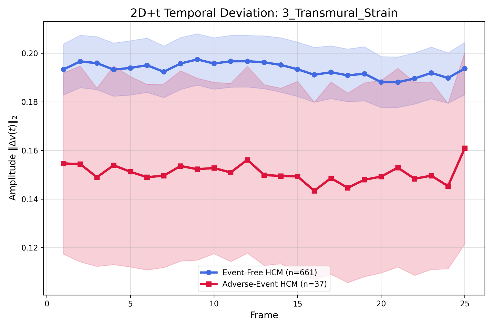

</div>

<p align="center"><strong>图 18</strong></p>


心内膜与心外膜的孤立运动虽能反映边界流体力学与刚体位移特征，但真正决定心脏做功 效率与心肌本构特性的，是内、外膜在空间中的相对运动梯度。我们将当前帧内、外膜各自的动 态轨迹相减（vdiff(t) = vendo(t)−vepi(t)），提取了跨壁运动学发散度。该指标在物理本质上彻 底剔除了患者个体静态室壁厚度的干扰，纯粹量化了心肌层在收缩过程中的动态增厚率与做功幅度。

对跨壁2D+t 时序偏离度的大样本统计显示，生存组的宏观发散度轨迹稳定在较高区间（∼0.19），保留了明显的跨壁收缩梯度。而死亡组的发散度曲线振幅大幅缩水至 0.15 左右，且曲线波动趋于低平。


<div align="center">

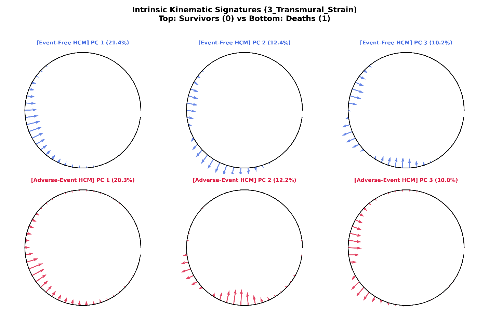

</div>

<p align="center"><strong>图 19</strong></p>


在独立子流形逆映射的形变场分析中，我们发现了与心内/外膜域发生的形变场空间重定向不同，死亡组跨壁主导基底（红色箭头）与生存组（蓝色箭头）在空间方向上呈现出高度的一致性。二者的特征变形均主要沿心室壁 （尤其是左侧室间隔与下壁）的法线方向，表现为向心的径向增厚（RadialThickening）意图。

综上所述，通过内膜心腔闭塞、外膜失代偿外膨与跨壁僵硬衰竭的三维动力学解耦，本研 究构建的主成分物理逆映射架构，获得了驱动HCM走向致死性终点事件的影像学本构规律


<div align="center">

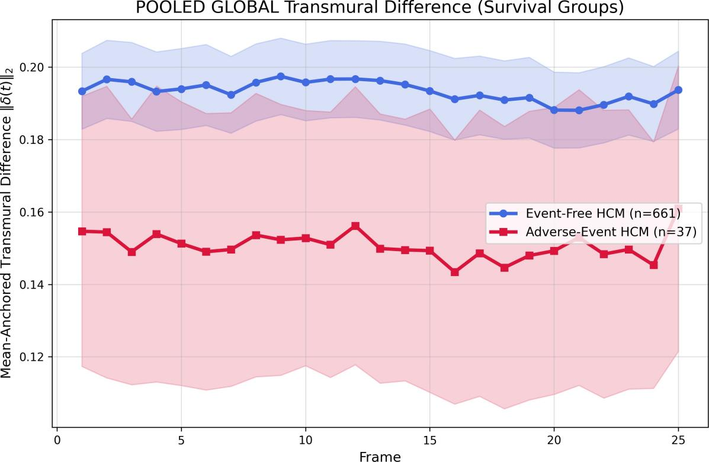

</div>

<p align="center"><strong>图 20</strong></p>


<div align="center">

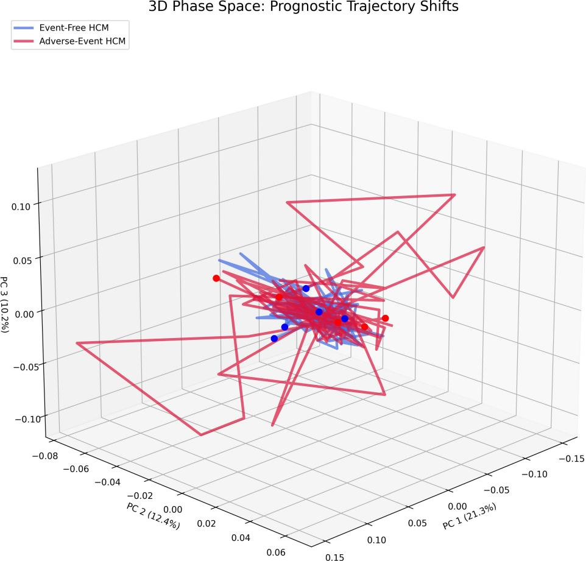

</div>

<p align="center"><strong>图 21</strong></p>


<div align="center">

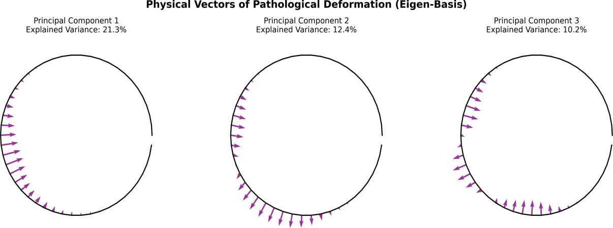

</div>

<p align="center"><strong>图 22</strong></p>


<div align="center">

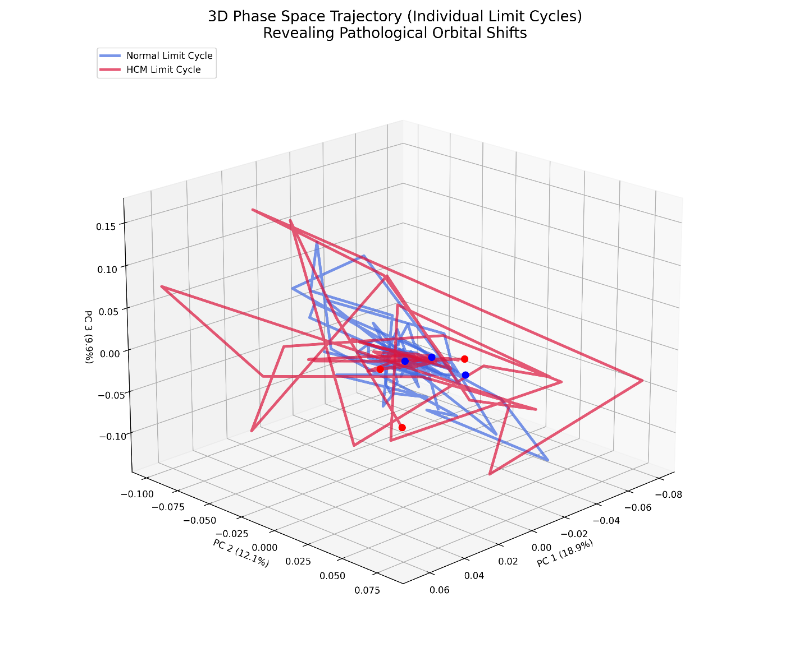

</div>

<p align="center"><strong>图 23</strong></p>


路径二：AHA 17 节段 + 心肌环几何 + 相位派生特征，对齐 Excel 终点；**第五章**给出主分析与敏感性。


---

## 第五章 阶段二·路径二：几何—节段特征与临床终点预测（主分析）

与**第四章**同期并行：共享短轴掩膜；预后以 **`endpoint`/`time`** 监督；固定划分下报告校准、DCA、阈值、Bootstrap 等 **TRIPOD 式**内容。**§5.1–§5.11** 为技术展开；跨第三～五章对比前读**第六章**。


> **约定**：除 **§5.9–§5.10**、**§5.11** 脚注外，数值图默认可在 **`outputs_clinical_endpoint_n320_bs400/`**。**`endpoint`、`time`** 以 §2 与数据字典为准。

### 5.1　实验批次与择优准则

已在仓库落盘的实验批次示例（同一脚本，参数组合不同）：

| ID | 输出目录（相对工作区或仓库根） | 入组 / 要点 | 树/MLP/融合标签 | 备注 |
|----|--------------------------------------|-------------|-----------------|------|
| E0 | `outputs_deep_full_gpu_sprint3` | 历史 sprint | 基于 **`time`≤1095 天** 构造的代理二类标签（与本篇 **`endpoint`** 字段不同） | 仅作史学定位 |
| E1 | `outputs_deep_full_gpu_clinical_endpoint` | 首批 endpoint | **`endpoint`** | 冒烟扩展 |
| E2 | `outputs_clinical_endpoint_n320_bs400` | `min_samples=320`, `bootstrap=400` | **`endpoint`** | **择优冠军（下文默认）** |
| E3 | `outputs_clinical_endpoint_full_bs400` | `--full-cohort`, `bootstrap=400` | **`endpoint`** | **`endpoint`=1** 稀疏 / 敏感性 |
| E4 | `outputs_clinical_endpoint_full_bs400_seeds5` | 较 E3 增 eval-seeds | **`endpoint`** | 稳健加厚 |
| E5 | `outputs_clinical_endpoint_champion_n320_iso` | 冠军入组 + isotonic | **`endpoint`** | 校准副业 |
| Pack | `report_champion_bundle_20260501_1338/` | — | — | 归档拷贝 |

**择优准则**（`report_champion_selection.json`）：外测 **`model6_ensemble_endpoint`** 上 **`0.4·AUC + 0.3·BA@0.5 + 0.3·F1@0.5`** 极大化；平局 **MCC@0.5** 更大优先，再 **Brier** 更小。**E2（本目录）** 构成正文主干；**§5.2–§5.8** 的图表与表里数字默认来自本次 E2 跑批；**§5.9** **另附** **full-cohort** 输出目录 **`outputs_clinical_endpoint_full_bs400/`** 的数字与图；**§5.10–§5.11** 为校准副业与其它监督口径的注意项。

**冠军外层划分简述**（`protocol_endpoint.json`）：训练 **199**（其中 **`endpoint`=1** 共 **34**，占 **17.1%**）；测试 **67**（其中 **`endpoint`=1** 共 **11**，占 **16.4%**）； cohort 计数 RJ_az **41** / me **146** / zhang **79**。

---

### 5.2　阈 0.5：tree / MLP / 融合与指标复核图

在完成 **外层划分 — 特征缩放 — OOF 定 `w`** 后，我们首先在外测读出 **二类 endpoint 判别**（与临床常用的 **0.5 概率阈**对齐），并与 **判别排序（AUC）**、**校准误差（Brier/ECE）** 一并观察。

#### 表 1　endpoint 二分类（阈值=0.5）与概率质量（冠军外测，`metrics_endpoint_binary_test.csv`）

| 模型 | AUC | Bal.Acc@0.5 | F1@0.5 | MCC@0.5 | Brier | ECE |
|------|-----|-------------|--------|---------|-------|-----|
| Tree (`model4_tree_endpoint`) | 0.692 | 0.664 | 0.471 | 0.425 | 0.119 | 0.113 |
| MLP (`model5_mlp_endpoint`) | **0.807** | 0.684 | 0.424 | 0.291 | 0.173 | 0.174 |
| Ensemble (`model6_ensemble_endpoint`) | 0.786 | **0.701** | **0.480** | 0.367 | 0.132 | 0.149 |

**本步可读结论**：单次划分上 **MLP 的 endpoint AUC 最高**；**融合在 0.5 阈值下提高了 BA/F1**，并与预选 **加权综合分 ≈0.669** 一致。**探索延续问题**：仅以 0.5 与 scalars 仍不足以回答 **时间尺度上的排序一致性**——故进入 **§5.3**。为将「三模型并排」转成 **出版级自检图**，可由 CSV 绘制 **热力图–分组柱**（**图 30**）。

#### 图 30　三模型外测 endpoint 指标的「热力图 + 分组柱」双编码（`figures_extra/`）


<div align="center">


</div>

<p align="center"><strong>图30 三模型 endpoint 指标组合图</strong></p>


---

### 5.3　Cox、C-index 与 time-dependent AUC

同一外测上报告 **原始 / 符号校正 C-index**。对 **给定 horizon** **h ∈ {365, 730, 1095}**（与 `time` 单位一致，为天；图示上可作约 12/24/36 个月的阅读辅助），脚本构造 **二进制结局** **`I(endpoint=1 且 time≤h)`**，与各模型打分算 **ROC-AUC**（表中 **AUC@365d / 730d / 1095d**）。此即 **在给定日历长度内是否发生记录的终点事件**的排序判别，**与直接使用列 `endpoint` 作为全体外测判别标签（§5.2、§5.4）是不同层级的问题**；**h 只进入该子任务的标签构造**，**不改写** **`endpoint`** 在研究表中的语义。

#### 表 3　C-index（raw/adj）与各 horizon 之 time-dependent AUC（`metrics_fixed_test.csv`）

| 模型 | C-index（raw） | C-index（adj） | AUC@365d | AUC@730d | AUC@1095d |
|------|----------------|----------------|----------|----------|-----------|
| model1_base_cox | 0.463 | 0.537 | 0.406 | 0.406 | 0.406 |
| model2_geom_cox | 0.556 | 0.556 | 0.409 | 0.409 | 0.409 |
| model3_full_cox | 0.593 | 0.593 | 0.524 | 0.524 | 0.524 |
| model4_tree_auto | 0.519 | 0.519 | 0.692 | 0.692 | 0.692 |
| model5_mlp_auto | 0.722 | 0.722 | 0.807 | 0.807 | 0.807 |
| model6_ensemble_auto | 0.630 | 0.630 | 0.786 | 0.786 | 0.786 |

#### 图 24　多模型 time-dependent AUC（horizon：**365 / 730 / 1095** 天；与 §5.2、§5.4 单列 `endpoint` 判别不同，见上文）


<div align="center">


</div>

<p align="center"><strong>图24 各模型 time-dependent AUC</strong></p>


**小结**：在上述 **依赖 `time` 与 horizon 的子任务** 上，MLP / 融合的 time-dependent AUC 仍较高，Cox 全模型相对树/判别器偏弱——与 **直接使用 `endpoint` 的全样本二类判别**并行，可作为 **预后时间结构**的补充呈现。

---

### 5.4　二元 endpoint 的标准 ROC

在完成 **时间点扫描**之后，必须把读者带回 **`endpoint` 本体**上最常见的 **灵敏度–特异度平面图**，并与 **表 1** AUC **同一标签口径**。**图 25** 使用外测 bundle 给出的 **tree / MLP / 融合概率** 与 **Cox 全模型的风险得分**（风险亦为合法排序刻度）画 **ROC**。对角线为 **随机参照**。

#### 图 25　外测 endpoint 多曲线 ROC（`figures/roc_endpoint_multimodel_test.png`）


<div align="center">

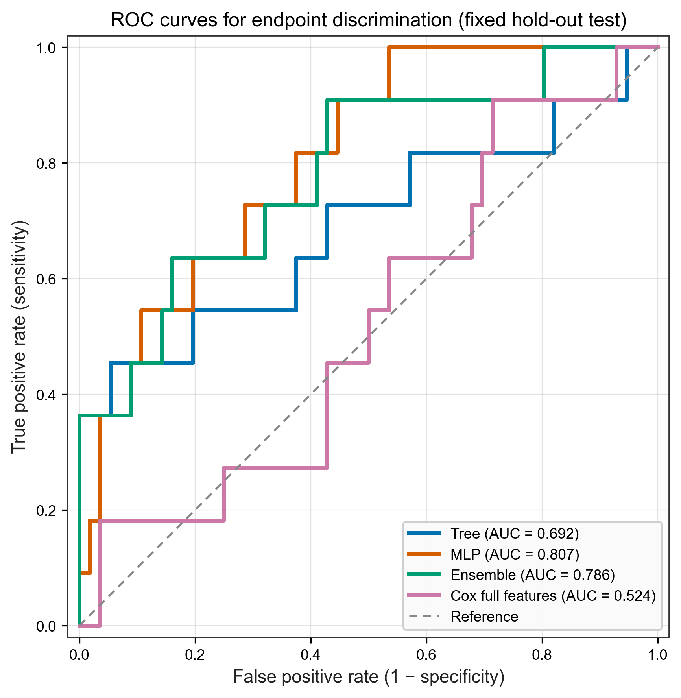

</div>

<p align="center"><strong>图25 外测 ROC 曲线 多模型</strong></p>


---

### 5.5　校准与决策曲线

若仅用 AUC，会掩盖 **校准不良**导致的 **阈值解读失败**。**图 26** 为融合概率的 **可靠性曲线与概率分布**并排；**图 27** 为 **DCA**，与 intervention-for-all / none 比对 **净获益**。

#### 图 26　融合校准诊断（校准 + 预测概率密度，`figures/`）


<div align="center">


</div>

<p align="center"><strong>图26 融合模型校准曲线与概率分布</strong></p>


#### 图 27　决策曲线 DCA（`figures/`）


<div align="center">


</div>

<p align="center"><strong>图27 融合模型决策曲线</strong></p>


**探索延伸（可选副业）**：在 **`outputs_clinical_endpoint_champion_n320_iso`** 若已生成带 `_isotonic` 后缀的同构图与 CSV，可作 **附录图 S1/S2**——见 **§5.10**。**主文不改变图 26/4 的默认文件名。**

---

### 5.6　OOF 定阈值与外测复述

阈值 **完全来自训练折 OOF 融合概率** 的规则扫描；每条规则对应一个 **阈值**，在外测复述 **Sens / Spec / PPV / NPV / LR / BA / F1** 见 **表 2**，可视化见 **图 31**。**图 31** 为三指标柱状与 **Sens–Spec** 散点（标记大小 / 颜色对应 BA）。

#### 表 2　融合模型：按 OOF 规则选阈在外测上的表现（`clinical_thresholds_test_performance.csv`；单次 AUC 与此前一致）

| 规则（OOF） | Sens | Spec | PPV | NPV | LR+ | LR− | BA | F1 |
|-------------|------|------|-----|-----|-----|-----|-------|-------|
| `max_balanced_accuracy` (= `max_youden_j`，阈≈**0.259**) | **0.636** | **0.714** | **0.304** | **0.909** | **2.23** | **0.51** | **0.675** | **0.412** |
| `conservative_high_specificity`（阈≈**0.068**） | 0.727 | 0.625 | 0.276 | 0.921 | 1.94 | 0.44 | 0.676 | 0.400 |
| `aggressive_high_sensitivity`（阈≈**0.130**） | **0.727** | **0.661** | 0.296 | 0.925 | 2.14 | **0.41** | **0.694** | **0.421** |

**阅读提示**：在低 PPV 与 **相对较高 NPV** 并存时，叙事需与外测 **`endpoint`=1 占比（约 16%）** 绑定；该比例不同于自然人群发病率，亦非对列 **`endpoint`**「按年」重新定义。

#### 图 31　阈值规则的柱–散点复合图（`figures_extra/`）


<div align="center">

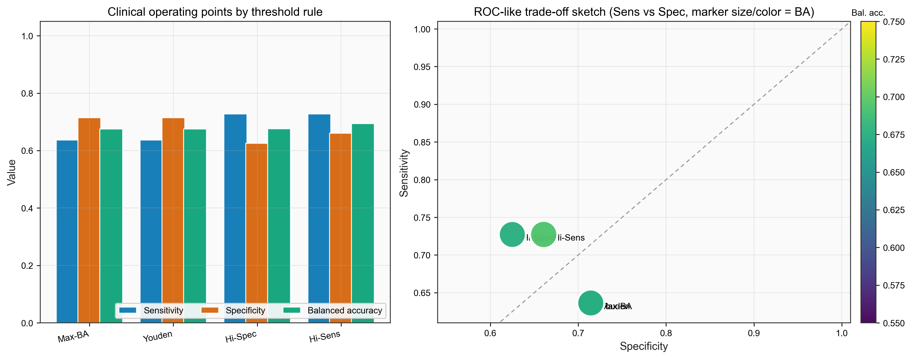

</div>

<p align="center"><strong>图31 阈值规则组合图</strong></p>


---

### 5.7　Bootstrap 与多 seed

外层测试集中 **`endpoint`=1** **仅 11 例**：点估计宜与 **Bootstrap 等非参数区间**共读。

- **Bootstrap（B=400）**：重复扰动 **外测索引** 堆积 ROC-AUC（及主阈下 Sens/Spec/BA/F1），得 **百分位区间**（**非**严格贝叶斯后验）。
- **多 seed（默认 3）**：**冻结划分与融合权重**，仅重置树与 MLP 初始化，观察 **判别与阈上性能的稳定性**。

#### 表 4　Bootstrap 摘要节选（`metrics_ci_summary.csv`）

| 指标 | 均值 | 2.5% | 97.5% |
|------|------|------|-------|
| model6_ensemble_auto_auc_endpoint | 0.787 | 0.604 | 0.932 |
| model5_mlp_auto_auc_endpoint | 0.810 | 0.661 | 0.932 |
| model4_tree_auto_auc_endpoint | 0.699 | 0.485 | 0.901 |
| model6_ensemble_balanced_accuracy_thr_oob | 0.681 | 0.520 | 0.844 |
| model6_ensemble_f1_thr_oob | 0.410 | 0.207 | 0.611 |
| model6_ensemble_sensitivity_thr_oob | 0.648 | 0.333 | 0.925 |
| model6_ensemble_specificity_thr_oob | 0.715 | 0.597 | 0.825 |

#### 图 32　Bootstrap 区间「森林摘要」可视化（融合，`figures_extra/`）


<div align="center">

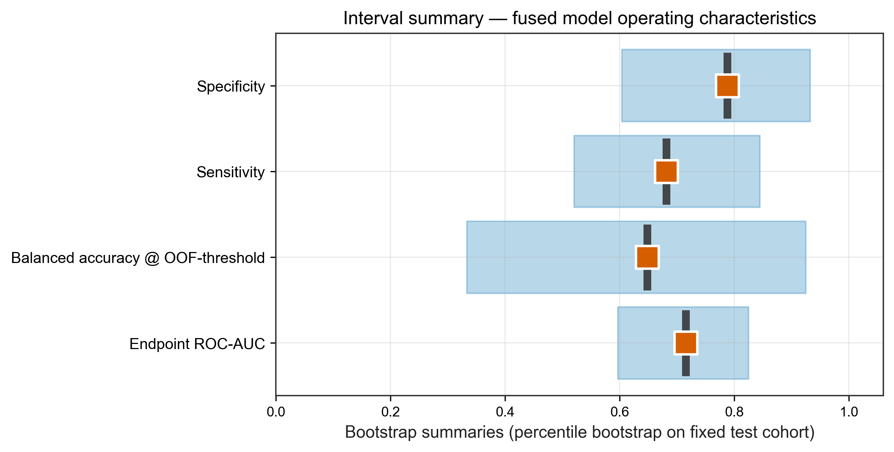

</div>

<p align="center"><strong>图32 Bootstrap 区间森林图</strong></p>


#### 图 33　融合 endpoint AUC 的 Bootstrap：**直方图 + KDE + 正态 Q–Q**（`figures_extra/`）


<div align="center">


</div>

<p align="center"><strong>图33 Bootstrap AUC 分布与 Q-Q</strong></p>


#### 表 5　多 seed 概要（固定 OOF 主阈，`seed_repeat_summary.csv`）

| 指标 | 均值 | 2.5% | 97.5% |
|------|------|------|-------|
| model6_ensemble_auc_endpoint | 0.797 | 0.794 | 0.799 |
| model6_ba_thr_oob | 0.678 | 0.667 | 0.692 |
| model6_f1_thr_oob | 0.416 | 0.401 | 0.436 |
| model6_spec_thr_oob | 0.720 | 0.697 | 0.748 |

**前进小结**：Bootstrap 提醒我们 **单次 AUC 的区间仍可很宽**，而 multi-seed **在固定权重下的 AUC 抖动相对小**——两类不确定性回答不同问题。

---

### 5.8　节段图景与 Cox top5 一致性

在进入 **`endpoint`=1 稀疏入组敏感性**的讨论之前，先在 **建模全队列空间**检视 **事件减非事件的节段振幅平均差**，并在 **训练 Bootstrap 重复拟合 Cox-full**时统计 **|coef|进入 top5节段** 的频率。**图 28/6** 为 AHA17 **映射**，**表 6** 与 **图 34（条形轨迹线）** 给出 **可读排序**。这与 **判别器**是分视角证据：解释性≠独立泛化验证。

#### 图 28　事件减非事件的节段均值差（matplotlib `RdBu_r` 色谱，`figures/`）


<div align="center">


</div>

<p align="center"><strong>图28 牛眼图 事件减去非事件</strong></p>


#### 图 29　Cox-full Bootstrap 稳定性映射（`|coef|` top-5 频率，`figures/`）


<div align="center">

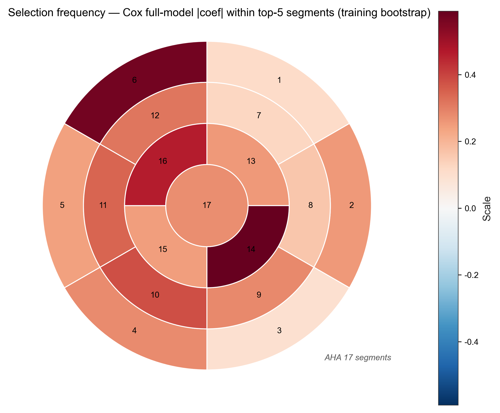

</div>

<p align="center"><strong>图29 节段 Cox top5 稳定性</strong></p>


#### 表 6　节段进入 Cox-full（全协变量 Cox）模型 top5 的频率（节选，`segment_stability.csv`；≤200 次 bootstrap）

| 节段 | 进入 top5 次数 | 频率 |
|------|----------------|------|
| seg14_amp | 118 | 59% |
| seg06_amp | 114 | 57% |
| seg16_amp | 93 | 46.5% |
| seg10_amp | 76 | 38% |
| seg11_amp | 69 | 34.5% |

#### 图 34　上位节段频率「条 + 轨迹线」组合（`figures_extra/`）


<div align="center">

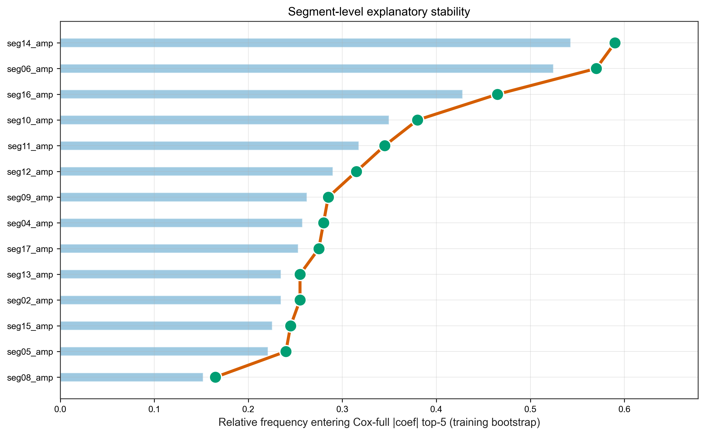

</div>

<p align="center"><strong>图34 节段 Cox top5 频率组合图</strong></p>


---

### 5.9　入组敏感性：主分析 vs full-cohort

**与早期同标签跑法对比**（`outputs_deep_full_gpu_clinical_endpoint` vs 冠军 E2）：

| | AUC | BA@0.5 | F1@0.5 | 择优综合 |
|---|-----|--------|--------|----------|
| 早期 clinical_endpoint 融合 | 0.789 | 0.656 | 0.417 | **≈0.637** |
| **冠军 n320_bs400 融合** | 0.786 | **0.701** | **0.480** | **≈0.669** |

**full-cohort 敏感性（`outputs_clinical_endpoint_full_bs400`）**：训练 **578**（其中 **`endpoint`=1** ≈ **7.4%**），测试 **193**（≈ **7.8%**）。

| 模型（融合） | AUC | BA@0.5 | F1@0.5 | 择优综合 |
|---------------|-----|--------|--------|----------|
| `model6_ensemble_endpoint`（全队列） | **0.579** | 0.577 | 0.192 | **≈0.462** |

**图 35** 在主分析入组与 **full-cohort** 之间并排 **`endpoint`** 判别指标并作差分。**写法建议**：在未说明 **抽样 / 事件占比 / 配额**的前提下，不宜将两套入组对应的数字归结为单一的「优劣」论断。

#### 图 35　入组策略敏感性：并排柱 + 指标差分（`figures_extra/`）


<div align="center">


</div>

<p align="center"><strong>图35 两队列融合模型指标对比</strong></p>


---

### 5.10　Isotonic 与 NRI/IDI（可选）

若以 **校准与决策曲线可读性**为重，副业 **isotonic** 可与 **§5.5（图 26–4）** 对照刊出；若以 **与原融合概率标尺一致**为原则，仍以 **§5.5** 主图为准。

#### 表 7　NRI / IDI（单次外测，`nri_idi_fixed_test.csv`，参照 model1_base_cox）

| 模型 | NRI vs base | IDI vs base |
|------|-------------|-------------|
| model2_geom_cox | −0.273 | −0.458 |
| model3_full_cox | +0.019 | **−87.33** |
| model4_tree_auto | 0 | +0.203 |
| model5_mlp_auto | 0 | +0.361 |
| model6_ensemble_auto | 0 | +0.290 |

**方法学警钟**：标尺混用可使 **IDI 极端**（见 NRI / IDI 相关讨论[15][16]）；表中 **full_cox IDI** 不宜作主定量结论。

---

### 5.11　sprint3 与 `auc_1095d` 的语义边界

`sprint3` 等指标 **auc_1095d**（如文献中常汇报的 **`metrics_fixed_test.csv`** **AUC@1095d**）依附于 **前述 horizon 判别构造**；本篇 **表 1 / 图 25** 的 **`endpoint`** AUC **则基于列 `endpoint` 本身**。**并排引用时建议先分列任务**，再讨论模型差异。


---

## 第六章 阶段对照、任务边界与结果可读性说明

### 6.1　时间轴与路径关系

**第三章**：早期多中心规范化与体素/区域探索。**第四章**与**第五章**：后期同一时段内并行、问题不同的两条路径，非替代关系。

### 6.2　监督、入组与指标并读禁忌

中期节选在标签、划分上与第五章 Excel **`endpoint`** 及固定外层 `train_test_split(..., stratify=endpoint, random_state=20260501)` **不可等同**；流形章以组间运动学为主，样本量与分组以该章为准。**禁止**把第三、四、五章的准确率、PCA/轨迹图与 AUC 写成「同一模型逐级改进」。

### 6.3　共享影像底座与分叉点

多中心短轴 CMR + 第二章 **§2.2** 掩膜为共同起点；其后分叉为 **HDF5 体素张量** / **轮廓—流形—2D+t**，或 **几何量 + 17 节段 + 预后协议**。

### 6.4　与后文讨论的关系

**第七章**在此框架下讨论双轨与中期瓶颈，并交代外推与标签语义限制。

---

## 第七章 讨论（收束多条探索支线）

### 7.1　从工程基线到「机理—预后」双轨

第三章在多中心异质格式上建立输入规范与早期深度/传统模型，暴露出 Rare-event 与表示瓶颈。**路径一**（第四章）：流形压缩刚体/尺度，聚焦相对运动学与跨壁动力学。**路径二**（第五章）：对齐可核对终点，固定划分下报告判别、校准与阈值。**§2.2** 为共同入口；并读时先在**任务定义**层区分，再谈临床含义—**勿**把 AUC 与流形主成分混为一谈。

### 7.2　分要点收束


**(1)** 本篇按 **scout → 协议固定 → 批次递增 → 择优冠军**书写，意在把 **判别、存活时间视角、校准、阈值复述、不确定性、解释性与入组敏感性**连成 **可追溯链条**，而非单点「报一个 AUC」。

**(2)** **判别器 vs Cox**：在 **依 `time` 截断的 time-dependent ROC**（图 24）上浅 **MLP / 集成** 排序常更强；在全队列 **`endpoint`=1** 仅占约 **8%** 的 **full-cohort** 入组下 **fusion AUC（≈0.58）** 回落，提示 **Rare-event（罕见阳性）与入组敏感性**——须与 **`endpoint` 占比** 共读，**不宜**仅从算法层面判优劣。

**(3)** **MLP vs 融合**：**MLP 排序常更强**，**融合**在 **加权综合准则**与 **校准/阈值点**上折中；部署选择应依赖 **外部数据与代价矩阵**而非单次划分玄学。

**(4)** **小样本与外测**：测试集 **`endpoint`=1** 仅 **11 例** ⇒ **Bootstrap 区间仍宽（表 4、图 32–33）**；多 seed 下 **endpoint AUC** 抖动相对小，二者互补。

**(5)** **NRI/IDI（表 7）** 指标体系与解释框架见参考文献[15][16]；本表仅供探索性阅读，不因单一数字作强结论。

**(6)** **局限**：多来源异质；**`endpoint`、`time`** 须在数据字典中与临床称谓一致；sprint 与 **`endpoint`** 监督语义不同；Word 排版时流程图见 `report_assets/flowcharts/*.png`。


---

## 第八章 结论与展望

### 8.1　主要结论


在 **固定外层划分与预选加权准则**下，**tree-MLP（树与浅层神经网络）融合**在主分析 **`min_samples≈320` 队列**上达到外测 **`endpoint`** 判别 **AUC≈0.79 量级**，阈 **0.5** 时 **BA/F1** 优于同标签早期冒烟融合；依托 **OOF 主阈值**可在外测复述 **Sens/Spec/NPV** 等。**full-cohort** 表明 **`endpoint`=1** 稀疏时判别排序显著走弱，宜与主分析 **并列陈述**。推荐使用 **`report_champion_bundle_20260501_1338`** 作为一级复现材料； **`outer_test_predictions_bundle.csv`** 中含外测 **`endpoint`、`time`** 与模型输出，便于复核。

### 8.2　创新点与整合贡献

（1）阶段一：张量规范化与基线模型，显式化多中心可学性与 Rare-event 瓶颈。（2）阶段二并行：第四章流形/2D+t 与第五章几何—节段—终点，分别承担机理表述与 TRIPOD 式预后报告。（3）第六章固定跨路径并读规则，抑制 AUC、流形分量与准确率混读。

### 8.3　局限性与展望

单中心划分复现、外测事件例数少、sprint 与 Excel **`endpoint`** 并存、分割权重与解剖命名待与训练方对齐—外推需谨慎。后续：前瞻性数据、外部验证、统一终点/数据字典、在明确决策代价下评估净获益。

预后主文数字：**第五章**冠军批次；第三、四章结论各依其监督定义陈述，临床并读见**第七章**。


---

## 参考文献

正文引用统一为 **方括号序号 [n]**，与下列文献表对应：**[1]–[16]** 为方法学与预后建模主线；**[17]–[22]** 为第四章（流形 / 2D+t）Formal 引文；**[23]–[27]** 为中期报告原稿补充（亦见文末附录）。

**[1]** CERQUEIRA M D, WEISSMAN N J, DILSZIAN V, et al. Standardized myocardial segmentation and nomenclature for tomographic imaging of the heart: a statement for healthcare professionals from the Cardiac Imaging Committee of the Council on Clinical Cardiology of the American Heart Association[J]. *Circulation*, 2002, 105(4): 539-542.

**[2]** COX D R. Regression models and life-tables[J]. *Journal of the Royal Statistical Society: Series B (Methodological)*, 1972, 34(2): 187-220.

**[3]** HARRELL F E JR, LEE K L, MARK D B. Multivariable prognostic models: issues in developing models, evaluating assumptions and adequacy, and measuring and reducing errors[J]. *Statistics in Medicine*, 1996, 15(4): 361-387.

**[4]** HEAGERTY P J, LUMLEY T, PEPE M S. Time-dependent ROC curves for censored survival data and a diagnostic marker[J]. *Biometrics*, 2000, 56(2): 337-347.

**[5]** VICKERS A J, ELKIN E B. Decision curve analysis: a novel method for evaluating prediction models[J]. *Medical Decision Making*, 2006, 26(6): 565-574.

**[6]** STEYERBERG E W, VERGOUWE Y. Towards better clinical prediction models: seven steps for development and an ABCD for validation[J]. *European Heart Journal*, 2014, 35(29): 1925-1931.

**[7]** HOSMER D W Jr, LEMESHOW S, STURDIVANT R X. *Applied Logistic Regression*[M]. 3rd ed. Hoboken: Wiley, 2013.

**[8]** ZADROZNY B, ELKAN C. Transforming classifier scores into accurate multiclass probability estimates[C]//Proceedings of the eighth ACM SIGKDD international conference on Knowledge discovery and data mining — KDD '02. New York: ACM, 2002: 694-699.

**[9]** CHEN T, GUESTRIN C. XGBoost: a scalable tree boosting system[C]//Proceedings of the 22nd ACM SIGKDD International Conference on Knowledge Discovery and Data Mining (KDD '16). ACM, 2016: 785-794.

**[10]** BRIER G W. Verification of forecasts expressed in terms of probability[J]. *Monthly Weather Review*, 1950, 78(1): 1-3.

**[11]** PEDREGOSA F, VAROQUAUX G, GRAMFORT A, et al. Scikit-learn: machine learning in Python[J]. *Journal of Machine Learning Research*, 2011, 12: 2825-2830.

**[12]** EFRON B, TIBSHIRANI R. *An introduction to the bootstrap*[M]. New York: Chapman & Hall, 1993.

**[13]** COLLINS G S, REITSMA J B, ALTMAN D G, MOONS K G M. Transparent Reporting of a multivariable prediction model for Individual Prognosis or Diagnosis (TRIPOD): the TRIPOD statement[J]. *Annals of Internal Medicine*, 2015, 162(1): 55-63.

**[14]** HANLEY J A, MCNEIL B J. The meaning and use of the area under a receiver operating characteristic (ROC) curve[J]. *Radiology*, 1982, 143(1): 29-36.

**[15]** PENCINA M J, D'AGOSTINO R B Sr, D'AGOSTINO R B Jr, et al. Evaluating the added predictive ability of a new marker: from area under the ROC curve to reclassification and beyond[J]. *Statistics in Medicine*, 2008, 27(2): 157-172.

**[16]** PENCINA M J, D'AGOSTINO R B Sr, STEYERBERG E W. Extensions of net reclassification improvement calculations to measures useful for categorical risk assessment[J]. *Clinical Epidemiology*, 2011, 3: 207-217.

**[17]** HE J, et al. Improve myocardial strain estimation based on deformable groupwise registration with a locally low-rank dissimilarity metric[J]. *Journal of Cardiovascular Magnetic Resonance*, 2024, 26(1): 101004.

**[18]** CLOUGH J R, et al. A topological loss function for deep-learning based image segmentation using persistent homology[J]. *IEEE Transactions on Pattern Analysis and Machine Intelligence*, 2020, 44(12): 8766-8778.

**[19]** GALLI E, et al. Myocardial work in nonobstructive hypertrophic cardiomyopathy: implications for outcome[J]. *Journal of the American Society of Echocardiography*, 2020, 33(10): 1201-1208.

**[20]** AMZULESCU M S, et al. Myocardial strain imaging: review of general principles, validation, and sources of discrepancies[J]. *European Heart Journal-Cardiovascular Imaging*, 2019, 20(6): 605-619.

**[21]** OMMEN S R, et al. 2020 AHA/ACC guideline for the diagnosis and treatment of patients with hypertrophic cardiomyopathy[J]. *Journal of the American College of Cardiology*, 2020, 76(25): e159-e240.

**[22]** ROWIN E J, et al. Hypertrophic cardiomyopathy with left ventricular apical aneurysm: implications for risk stratification and management[J]. *Journal of the American College of Cardiology*, 2022, 79(25): 2465-2476.

注：Bootstrap 解释为 **外层测试集的重复抽样**，方法学上与文献[12]一致。


---

### 附：中期与合作者报告参考文献（原稿列举）

### 中期报告

**[23]** -, H.C., -, G.H., -, G.P., -, C.K.G., & -, R.S.P. (2025). Physiological and Pathological Hypertrophic Cardiomyopathy. International Journal For Multidisciplinary Research, 7(1). https://doi.org/10.36948/ijfmr.2025.v07i01.34963

**[24]** Li, L., Gao, J., Liu, X., Chen, B.-X., Su, P., & Xie, B. (2024). Tissue-level evidence of fibroblast activation protein inhibitor imaging in hypertrophic obstructive cardiomyopathy: a case series. European Heart Journal - Case Reports, 8(5). https://doi.org/10.1093/ehjcr/ytae189

**[25]** Zhou, S. K., Greenspan, H., Davatzikos, C., Duncan, J. S., Van Ginneken, B., Madabhushi, A., Prince, J. L., Rueckert, D., & Summers, R. M. (2021). A Review of Deep Learning in Medical Imaging: Imaging Traits, Technology Trends, Case Studies With Progress Highlights, and Future Promises. Proceedings of the IEEE, 109(5), 820–838. https://doi.org/10.1109/jproc.2021.3054390

**[26]** Tian, H. (2025). Progress in the application of deep learning in medical image recognition. Applied and Computational Engineering, 135(1), 10–18. https://doi.org/10.54254/2755-2721/2025.20964

**[27]** Katzmann, A., Muehlberg, A., Suehling, M., Norenberg, D., Holch, J. W., & Gross, H.-M. (2020). Deep Random Forests for Small Sample Size Prediction with Medical Imaging Data. 2020 IEEE 17th International Symposium on Biomedical Imaging (ISBI), 1543–1547. https://doi.org/10.1109/isbi45749.2020.9098420

### 流形 / 2D+t 报告（赵，Formal）

> **文献编序**：赵稿 Formal 与正文 **§参考文献** 中的 **[17]–[22]** 为同一组文献，此处不重列。


---

## 附录 A　临床主分析图表文件与正文图号对照（冠军目录）

| 文件（相对 `outputs_clinical_endpoint_n320_bs400/`） | 图号 | 正文绑定环节 |
|------------------------------------------------------|------|----------------|
| `figures/time_dependent_auc_curve.png` | 图 24（原临床报告图 1） | §5.3 |
| `figures/roc_endpoint_multimodel_test.png` | 图 25（原图 2） | §5.4 |
| `figures/calibration_curve_endpoint_ensemble.png` | 图 26（原图 3） | §5.5 |
| `figures/decision_curve_endpoint_ensemble.png` | 图 27（原图 4） | §5.5 |
| `figures/bullseye_standard_diff.png` | 图 28（原图 5） | §5.8 |
| `figures/bullseye_top5_stability.png` | 图 29（原图 6） | §5.8 |
| `figures_extra/fig_bar_models_endpoint_metrics.png` | 图 30（原图 7） | §5.2 |
| `figures_extra/fig_bar_threshold_rules.png` | 图 31（原图 8） | §5.6 |
| `figures_extra/fig_forest_bootstrap_ci_model6.png` | 图 32（原图 9） | §5.7 |
| `figures_extra/fig_hist_bootstrap_ensemble_auc_endpoint.png` | 图 33（原图 10） | §5.7 |
| `figures_extra/fig_bar_segment_stability_top.png` | 图 34（原图 11） | §5.8 |
| `figures_extra/fig_compare_two_cohorts_ensemble.png` | 图 35（原图 12） | §5.9 |
| `outer_test_predictions_bundle.csv` | — | ROC / 审稿复算 |

**表 1–7** 数据源：`metrics_endpoint_binary_test.csv`、`clinical_thresholds_*`、`metrics_fixed_test.csv`、`metrics_ci_summary.csv`、`seed_repeat_summary.csv`、`segment_stability.csv`、`nri_idi_fixed_test.csv`。其余：`bootstrap_metrics.csv`、`protocol.json`、`protocol_endpoint.json`。

---

## 附录 B　可复现实验命令范式

```powershell
# 冠军等价（主分析子集 + bootstrap400 + 自动算力）
python "deep_experiment_full_gpu.py" --min-samples 320 --bootstrap 400 --compute auto ^
  --output-dir "outputs_clinical_endpoint_n320_bs400"

# 全队列敏感性
python "deep_experiment_full_gpu.py" --full-cohort --bootstrap 400 --compute auto ^
  --output-dir "outputs_clinical_endpoint_full_bs400"

python "pick_report_champion.py"

# 第二章流程示意 PNG（matplotlib）
python "tools\render_flowchart_pngs.py"

python "make_report_extra_figures.py" --output-dir "outputs_clinical_endpoint_n320_bs400" ^
  --compare-endpoint-csv "outputs_clinical_endpoint_full_bs400\metrics_endpoint_binary_test.csv"
# `make_report_extra_figures.py` 会重写 `figures/`（ROC、校准、DCA、time-dep AUC、bullseye）与 `figures_extra/`；带 `--compare-endpoint-csv` 时另写图 12。
```

导出 Word（示例）：

```powershell
python "export_md_to_docx.py" "report_academic_full_integrated.md" --base-dir "e:\本基中间结果" -o "report_academic_integrated_revision.docx"
```

---

*数值与图片均依据当前仓库已跑批次；更改 seed、bootstrap、入组或数据路径后，请以最新 `outputs_*` 目录复核。*

---

## 附录 C　全文图号与来源对照

| 整合稿图号 | 来源 | 原图号 / 说明 |
|------------|------|----------------|
| 图 1–11 | 中期报告 Word 导出 | `report_assets/midterm/figure_01.png` 起 |
| （流程示意） | `report_assets/flowcharts/shortaxis_unet_pipeline.png` | 第二章 §2.2 |
| （流程示意） | `report_assets/flowcharts/endpoint_eval_pipeline.png` | 第二章 §2.4 |
| 图 12–23 | 合作者报告 `1_2D T 411-zhao.docx` | 原稿图 1–12 |
| 图 24–35 | 临床终点主分析（原 `report_academic_integrated.md`） | 原稿图 1–12 |

**表号**：中期原表属第三章；预后「表 1–7」属第五章；跨阶段并表须说明（第六章）。**图 1–35** 来源见上表。

